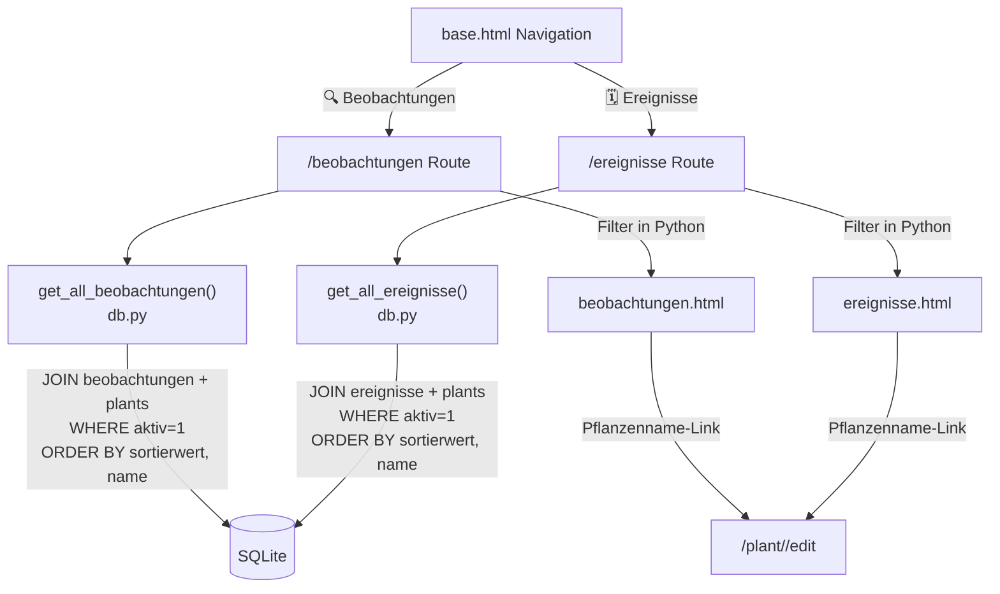

# Design-Dokument: Chronologische Listen

## Übersicht

Der Garten-Tracker erhält zwei neue Seiten: eine chronologisch sortierte Beobachtungsliste (`/beobachtungen`) und eine chronologisch sortierte Ereignisliste (`/ereignisse`). Beide Seiten zeigen pflanzenübergreifende Daten aller aktiven Pflanzen, sortiert nach einem berechneten Sortierwert aus Startmonat und optionaler Detail-Angabe (Anfang/Mitte/Ende). Beide Listen bieten Filter für Kategorie, Ereignistyp und Monat — analog zur bestehenden Pflanzenübersicht.

**Designentscheidungen:**
- Zwei neue DB-Funktionen in `db.py`: `get_all_beobachtungen()` und `get_all_ereignisse()` — jeweils mit JOIN auf `plants` für Pflanzenname, Kategorie und ID.
- Sortierwert-Berechnung als reine Funktion `berechne_sortierwert(monat, detail)` in `db.py`, wiederverwendbar für beide Listen.
- Sortierung direkt in SQL via `ORDER BY` auf den berechneten Sortierwert, sekundär nach Pflanzenname.
- Filterung in Python (analog zum bestehenden Muster in `index()`), da die Filter-Logik identisch ist.
- Zwei neue GET-Routen in `app.py`: `/beobachtungen` und `/ereignisse`.
- Zwei neue Templates: `beobachtungen.html` und `ereignisse.html`, die `base.html` erweitern.
- Navigation in `base.html` um zwei Links erweitert.
- Pflanzenname als Link zur Bearbeitungsseite (`/plant/<id>/edit`).
- Leere Zustände mit kontextabhängigen Meldungen (keine Daten vs. keine Filterergebnisse).

## Architektur



```
Browser
  │
  ├── GET /beobachtungen              → beobachtungen_page()
  │     ├── get_all_beobachtungen()   → JOIN beobachtungen + plants (aktiv=1)
  │     ├── Filter: kategorie, ereignis, monat (Python)
  │     └── render beobachtungen.html
  │
  └── GET /ereignisse                 → ereignisse_page()
        ├── get_all_ereignisse()      → JOIN ereignisse + plants (aktiv=1)
        ├── Filter: kategorie, ereignis, monat (Python)
        └── render ereignisse.html
```

Keine neuen Abhängigkeiten. Minimales Inline-JS für Filter-Dropdowns (`onchange`).

## Komponenten und Schnittstellen

### db.py — Neue Funktionen

**`berechne_sortierwert(monat: int, detail: str | None) -> int`** (neue Funktion)
- Reine Funktion ohne DB-Zugriff.
- Berechnet: `monat * 100 + offset`, wobei:
  - `"Anfang"` → offset = 5
  - `"Mitte"` → offset = 15
  - `"Ende"` → offset = 25
  - `None` / leer → offset = 15 (Einordnung in die Mitte)
- Wird für die SQL-Sortierung und ggf. Template-Anzeige verwendet.

**`get_all_beobachtungen() -> list[dict]`** (neue Funktion)
- JOIN `beobachtungen` mit `plants` (nur `aktiv = 1`).
- Gibt pro Eintrag zurück: `beobachtung_id`, `plant_id`, `plant_name`, `kategorie`, `jahr`, `ereignistyp`, `startmonat`, `endmonat`, `start_detail`, `end_detail`, `notiz`, `sortierwert`.
- Sortierung: `sortierwert ASC, plant_name ASC` (via SQL `ORDER BY`).
- Der Sortierwert wird in SQL berechnet:
  ```sql
  (b.startmonat * 100 + CASE b.start_detail
      WHEN 'Anfang' THEN 5
      WHEN 'Ende' THEN 25
      ELSE 15
  END) AS sortierwert
  ```

**`get_all_ereignisse() -> list[dict]`** (neue Funktion)
- JOIN `ereignisse` mit `plants` (nur `aktiv = 1`).
- Gibt pro Eintrag zurück: `ereignis_id`, `plant_id`, `plant_name`, `kategorie`, `ereignistyp`, `startmonat`, `endmonat`, `start_detail`, `end_detail`, `sortierwert`.
- Sortierung: `sortierwert ASC, plant_name ASC` (via SQL `ORDER BY`).
- Gleiche CASE-Expression für den Sortierwert.

### app.py — Neue Routen

**Import-Änderung:**
```python
from db import (..., get_all_beobachtungen, get_all_ereignisse, berechne_sortierwert)
```

**`GET /beobachtungen` → `beobachtungen_page()`** (neue Route)
- Ruft `get_all_beobachtungen()` auf.
- Liest Query-Parameter: `kategorie`, `ereignis`, `monat`.
- Filtert in Python (analog zu `index()`):
  - `kategorie`: `b["kategorie"] == filter_kategorie`
  - `ereignis`: `b["ereignistyp"] == filter_ereignis`
  - `monat`: `b["startmonat"] <= fm <= b["endmonat"]`
  - Alle Filter werden UND-verknüpft.
- Übergibt an Template: `beobachtungen`, `german_months`, `valid_kategorien`, `valid_ereignistypen`, Filter-Werte.

**`GET /ereignisse` → `ereignisse_page()`** (neue Route)
- Ruft `get_all_ereignisse()` auf.
- Identische Filter-Logik wie `beobachtungen_page()`.
- Übergibt an Template: `ereignisse`, `german_months`, `valid_kategorien`, `valid_ereignistypen`, Filter-Werte.

### templates/base.html — Änderung

Navigation um zwei Links erweitert:
```html
<nav>
    <a href="/beobachtungen" ...>🔍 Beobachtungen</a>
    <a href="/ereignisse" ...>🗓️ Ereignisse</a>
    <a href="/phaenologie" ...>🍃 Phänologie</a>
</nav>
```

### templates/beobachtungen.html — Neues Template

- Erweitert `base.html`.
- Zurück-Link zur Übersicht.
- Filterleiste (Kategorie, Ereignistyp, Monat) — identisches Muster wie `index.html`.
- Link „Filter zurücksetzen" wenn mindestens ein Filter aktiv.
- Tabelle mit Spalten: Pflanzenname (Link zu `/plant/<id>/edit`), Jahr, Ereignistyp, Zeitraum, Notiz.
- Zeitraum-Darstellung: `[start_detail] Monat – [end_detail] Monat` (analog zu `edit.html`).
- Leerer Zustand: „Noch keine Beobachtungen vorhanden." (ohne Filter) oder „Keine Beobachtungen gefunden." + Reset-Link (mit Filter).

### templates/ereignisse.html — Neues Template

- Erweitert `base.html`.
- Zurück-Link zur Übersicht.
- Filterleiste (Kategorie, Ereignistyp, Monat) — identisches Muster.
- Tabelle mit Spalten: Pflanzenname (Link zu `/plant/<id>/edit`), Ereignistyp, Zeitraum.
- Leerer Zustand: „Noch keine Ereignisse vorhanden." oder „Keine Ereignisse gefunden." + Reset-Link.

### app.py — `_safe_next()` Änderung

Die Funktion `_safe_next()` muss `/beobachtungen` und `/ereignisse` als sichere Redirect-Ziele akzeptieren:
```python
if next_url and (next_url == "/" or next_url.startswith("/plant/")
                 or next_url.startswith("/phaenologie")
                 or next_url.startswith("/beobachtungen")
                 or next_url.startswith("/ereignisse")):
```

## Datenmodelle

### Keine Schema-Änderungen

Es werden keine neuen Tabellen oder Spalten benötigt. Die bestehenden Tabellen `beobachtungen`, `ereignisse` und `plants` enthalten bereits alle benötigten Daten.

### Bestehende Tabellen (relevant)

```
plants
  id            INTEGER PRIMARY KEY
  name          TEXT NOT NULL
  kategorie     TEXT
  aktiv         INTEGER DEFAULT 1
  ...

ereignisse
  id            INTEGER PRIMARY KEY
  plant_id      INTEGER NOT NULL → plants(id)
  ereignistyp   TEXT NOT NULL
  startmonat    INTEGER NOT NULL
  endmonat      INTEGER NOT NULL
  start_detail  TEXT
  end_detail    TEXT

beobachtungen
  id                    INTEGER PRIMARY KEY
  plant_id              INTEGER NOT NULL → plants(id)
  jahr                  INTEGER NOT NULL
  ereignistyp           TEXT NOT NULL
  startmonat            INTEGER NOT NULL
  endmonat              INTEGER NOT NULL
  start_detail          TEXT
  end_detail            TEXT
  phaenologische_phase  TEXT
  notiz                 TEXT
```

### SQL-Abfragen

**Beobachtungen (JOIN):**
```sql
SELECT b.id AS beobachtung_id, b.plant_id, p.name AS plant_name,
       p.kategorie, b.jahr, b.ereignistyp,
       b.startmonat, b.endmonat, b.start_detail, b.end_detail, b.notiz,
       (b.startmonat * 100 + CASE b.start_detail
           WHEN 'Anfang' THEN 5 WHEN 'Ende' THEN 25 ELSE 15
       END) AS sortierwert
FROM beobachtungen b
JOIN plants p ON b.plant_id = p.id
WHERE p.aktiv = 1
ORDER BY sortierwert ASC, p.name ASC
```

**Ereignisse (JOIN):**
```sql
SELECT e.id AS ereignis_id, e.plant_id, p.name AS plant_name,
       p.kategorie, e.ereignistyp,
       e.startmonat, e.endmonat, e.start_detail, e.end_detail,
       (e.startmonat * 100 + CASE e.start_detail
           WHEN 'Anfang' THEN 5 WHEN 'Ende' THEN 25 ELSE 15
       END) AS sortierwert
FROM ereignisse e
JOIN plants p ON e.plant_id = p.id
WHERE p.aktiv = 1
ORDER BY sortierwert ASC, p.name ASC
```

### Sortierwert-Berechnung

| Detail-Angabe | Offset | Beispiel (März = 3) |
|---------------|--------|---------------------|
| "Anfang"      | 5      | 3 × 100 + 5 = 305  |
| "Mitte"       | 15     | 3 × 100 + 15 = 315 |
| "Ende"        | 25     | 3 × 100 + 25 = 325 |
| None / leer   | 15     | 3 × 100 + 15 = 315 |


## Correctness Properties

*A property is a characteristic or behavior that should hold true across all valid executions of a system — essentially, a formal statement about what the system should do. Properties serve as the bridge between human-readable specifications and machine-verifiable correctness guarantees.*

**Property Reflection:** Nach der Prework-Analyse wurden folgende Konsolidierungen vorgenommen:
- 4.1–4.4 (Sortierwert für Anfang/Mitte/Ende/None) werden zu einer einzigen Property über die reine Funktion `berechne_sortierwert()` kombiniert.
- 2.3+2.4 (Beobachtungen-Sortierung) und 3.3+3.4 (Ereignisse-Sortierung) testen dieselbe Sortierlogik auf verschiedenen Datenquellen — kombiniert zu einer Property.
- 2.1 (nur aktive Beobachtungen) und 3.1 (nur aktive Ereignisse) testen dieselbe Invariante — kombiniert.
- 5.2+5.3+5.4+5.5 (Beobachtungen-Filter) und 6.2+6.3+6.4+6.5 (Ereignisse-Filter) verwenden identische Filterlogik; die Einzel-Filter-Properties sind durch die AND-Kombinations-Property subsumiert — kombiniert zu einer Property.
- 2.2+8.1 (Beobachtungen-Anzeige + Link) und 3.2+8.2 (Ereignisse-Anzeige + Link) werden jeweils kombiniert, da der Link Teil der Anzeige ist.

---

### Property 1: Sortierwert-Berechnung

*For any* Monat (1–12) und *for any* gültige Detail-Angabe ("Anfang", "Mitte", "Ende", None), `berechne_sortierwert(monat, detail)` SHALL den Wert `monat × 100 + offset` zurückgeben, wobei offset = 5 für "Anfang", 15 für "Mitte" oder None, 25 für "Ende".

**Validates: Requirements 4.1, 4.2, 4.3, 4.4**

---

### Property 2: Nur aktive Pflanzen in beiden Listen

*For any* Mischung aus aktiven und inaktiven Pflanzen mit Beobachtungen und Ereignissen, `get_all_beobachtungen()` SHALL nur Beobachtungen von Pflanzen mit `aktiv = 1` zurückgeben, und `get_all_ereignisse()` SHALL nur Ereignisse von Pflanzen mit `aktiv = 1` zurückgeben.

**Validates: Requirements 2.1, 3.1**

---

### Property 3: Sortierung nach Sortierwert und Pflanzenname

*For any* Menge von Beobachtungen bzw. Ereignissen, die von `get_all_beobachtungen()` bzw. `get_all_ereignisse()` zurückgegeben wird, SHALL die Liste aufsteigend nach Sortierwert sortiert sein. Bei gleichem Sortierwert SHALL die Sortierung alphabetisch nach Pflanzenname erfolgen.

**Validates: Requirements 2.3, 2.4, 3.3, 3.4**

---

### Property 4: Beobachtungen enthalten alle Pflichtfelder und Pflanzen-Link

*For any* Beobachtung einer aktiven Pflanze, die gerenderte Beobachtungsliste SHALL den Pflanzennamen als Link zu `/plant/<id>/edit`, das Jahr, den Ereignistyp, den Zeitraum (Startmonat mit Detail bis Endmonat mit Detail) und die Notiz (falls vorhanden) anzeigen.

**Validates: Requirements 2.2, 8.1**

---

### Property 5: Ereignisse enthalten alle Pflichtfelder und Pflanzen-Link

*For any* Ereignis einer aktiven Pflanze, die gerenderte Ereignisliste SHALL den Pflanzennamen als Link zu `/plant/<id>/edit`, den Ereignistyp und den Zeitraum (Startmonat mit Detail bis Endmonat mit Detail) anzeigen.

**Validates: Requirements 3.2, 8.2**

---

### Property 6: Filter-Kombination auf beiden Listen

*For any* Kombination von Filtern (Kategorie, Ereignistyp, Monat) auf der Beobachtungs- oder Ereignisliste, alle angezeigten Einträge SHALL alle aktiven Filterkriterien gleichzeitig erfüllen: Kategorie der Pflanze stimmt überein, Ereignistyp stimmt überein, und der gewählte Monat liegt im Zeitraum (startmonat ≤ Monat ≤ endmonat).

**Validates: Requirements 5.2, 5.3, 5.4, 5.5, 6.2, 6.3, 6.4, 6.5**

---

## Fehlerbehandlung

| Fehlerfall | Verhalten |
|---|---|
| GET `/beobachtungen` ohne Daten | Leere-Zustand-Meldung: „Noch keine Beobachtungen vorhanden." |
| GET `/ereignisse` ohne Daten | Leere-Zustand-Meldung: „Noch keine Ereignisse vorhanden." |
| GET `/beobachtungen?kategorie=XYZ` ohne Treffer | Meldung: „Keine Beobachtungen gefunden." + Reset-Link |
| GET `/ereignisse?monat=13` (ungültiger Monat) | Filter wird ignoriert (kein Crash), alle Einträge angezeigt |
| Ungültiger `monat`-Parameter (nicht-numerisch) | `int()`-Konvertierung schlägt fehl → Filter wird ignoriert |

Die Fehlerbehandlung für ungültige Filter-Parameter folgt dem bestehenden Muster aus `index()`: try/except um die `int()`-Konvertierung, bei Fehler wird der Filter nicht angewendet.

## Testing-Strategie

### Ansatz

Die Kernlogik besteht aus einer reinen Funktion (`berechne_sortierwert`), zwei DB-Abfragen mit JOIN und Sortierung, sowie Filter-Logik in Python. Property-Based Testing ist besonders geeignet für die Sortierwert-Berechnung (reine Funktion) und die Sortier-/Filter-Invarianten (universelle Eigenschaften über beliebige Daten).

**PBT-Bibliothek:** [Hypothesis](https://hypothesis.readthedocs.io/) (Python, bereits im Projekt vorhanden)

### Property-Based Tests (Hypothesis, min. 100 Iterationen je Property)

| Test | Property | Beschreibung |
|------|----------|--------------|
| `test_sortierwert_berechnung` | Property 1 | Zufälliger Monat + Detail → korrekter Sortierwert |
| `test_nur_aktive_pflanzen` | Property 2 | Zufällige aktive/inaktive Pflanzen → nur aktive in Listen |
| `test_sortierung_nach_sortierwert_und_name` | Property 3 | Zufällige Einträge → korrekte Sortierreihenfolge |
| `test_beobachtungen_pflichtfelder` | Property 4 | Zufällige Beobachtungen → alle Felder + Link im HTML |
| `test_ereignisse_pflichtfelder` | Property 5 | Zufällige Ereignisse → alle Felder + Link im HTML |
| `test_filter_kombination` | Property 6 | Zufällige Daten + Filter → alle Ergebnisse erfüllen alle Kriterien |

Tag-Format: `# Feature: chronologische-listen, Property {N}: {property_text}`

### Example-Based Tests (pytest)

| Test | Anforderung | Beschreibung |
|------|-------------|--------------|
| `test_navigation_links` | 1.1, 1.2, 1.3 | GET `/` enthält Links zu `/beobachtungen` und `/ereignisse` |
| `test_filterleiste_beobachtungen` | 5.1 | GET `/beobachtungen` enthält Filter-Dropdowns |
| `test_filterleiste_ereignisse` | 6.1 | GET `/ereignisse` enthält Filter-Dropdowns |
| `test_filter_reset_link_beobachtungen` | 5.6 | Filter aktiv → „Filter zurücksetzen"-Link vorhanden |
| `test_filter_reset_link_ereignisse` | 6.6 | Filter aktiv → „Filter zurücksetzen"-Link vorhanden |
| `test_leerer_zustand_beobachtungen` | 7.1 | Keine Daten → „Noch keine Beobachtungen vorhanden." |
| `test_leerer_zustand_ereignisse` | 7.2 | Keine Daten → „Noch keine Ereignisse vorhanden." |
| `test_keine_treffer_beobachtungen` | 7.3 | Filter ohne Treffer → „Keine Beobachtungen gefunden." + Reset-Link |
| `test_keine_treffer_ereignisse` | 7.4 | Filter ohne Treffer → „Keine Ereignisse gefunden." + Reset-Link |
