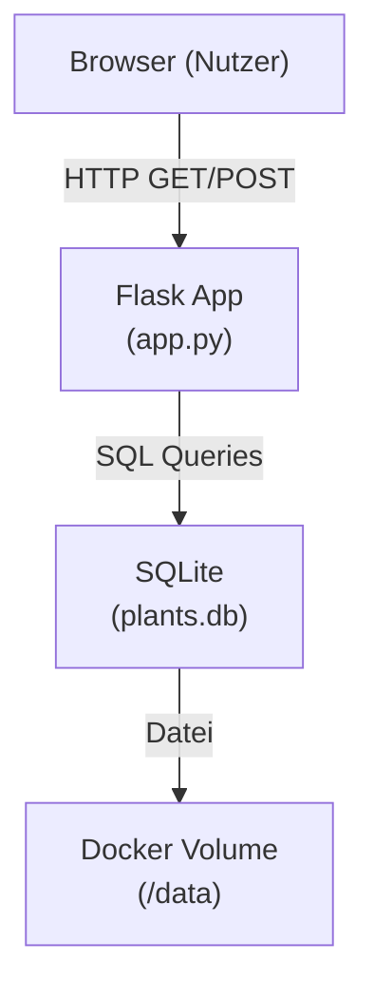

# Design Document: Garden Tracker

## Overview

Garden Tracker ist eine minimalistische Webanwendung zur Verwaltung von Gartenpflanzen. Die Anwendung läuft als Docker-Container auf einem Raspberry Pi (linux/arm64) und bietet eine einfache Pflanzenliste mit den Funktionen: Anzeigen, Hinzufügen und Entfernen von Pflanzen. Die Benutzeroberfläche ist vollständig auf Deutsch.

**Tech Stack:**
- Backend: Python 3.12 + Flask (leichtgewichtig, minimale Abhängigkeiten)
- Datenbank: SQLite via Python `sqlite3` Standardbibliothek (kein ORM nötig)
- Frontend: Jinja2-Templates + minimales CSS (kein JavaScript-Framework)
- Container: Docker, linux/arm64

**Rationale:** Flask ist für diese Größenordnung ideal — kein Overhead, keine externe Datenbank, läuft problemlos auf ARM64. SQLite über die Standardbibliothek vermeidet zusätzliche Abhängigkeiten.

---

## Architecture



Die Anwendung folgt einem einfachen Request-Response-Muster ohne asynchrone Komponenten:

1. Der Browser sendet HTTP-Anfragen (GET für Anzeige, POST für Hinzufügen/Entfernen).
2. Flask verarbeitet die Anfrage, führt SQL-Operationen auf SQLite aus.
3. Flask rendert ein Jinja2-Template und gibt HTML zurück.
4. Daten werden in einer SQLite-Datei auf einem Volume-Mount persistiert.

---

## Components and Interfaces

### Flask Application (`app.py`)

Drei Routen:

| Route | Methode | Beschreibung |
|-------|---------|--------------|
| `/` | GET | Pflanzenliste anzeigen |
| `/add` | POST | Neue Pflanze hinzufügen |
| `/remove/<int:id>` | POST | Pflanze entfernen |

### Database Layer (`db.py`)

Kapselt alle SQLite-Operationen:

```python
def get_db() -> sqlite3.Connection
def init_db() -> None          # Tabelle anlegen falls nicht vorhanden
def get_all_plants() -> list[dict]
def add_plant(name: str, type: str, variety: str | None) -> None
def remove_plant(plant_id: int) -> None
```

### Templates (`templates/`)

- `base.html` — Grundlayout mit deutschem `<html lang="de">`
- `index.html` — Pflanzenliste, Formular zum Hinzufügen, Leer-Zustand-Meldung

### Static Files (`static/`)

- `style.css` — Minimales CSS für lesbare Darstellung

---

## Data Models

### SQLite Schema

```sql
CREATE TABLE IF NOT EXISTS plants (
    id      INTEGER PRIMARY KEY AUTOINCREMENT,
    name    TEXT    NOT NULL,
    type    TEXT    NOT NULL,
    variety TEXT    -- optional, NULL wenn nicht angegeben
);
```

### Python-Darstellung (als dict)

```python
{
    "id":      int,
    "name":    str,   # z.B. "Erdbeere"
    "type":    str,   # z.B. "Obst"
    "variety": str | None  # z.B. "Elsanta" oder None
}
```

**Validierungsregeln:**
- `name` und `type` dürfen nicht leer oder nur Leerzeichen sein.
- `variety` ist optional; ein leerer String wird als `None` gespeichert.

---

## Correctness Properties

*A property is a characteristic or behavior that should hold true across all valid executions of a system — essentially, a formal statement about what the system should do. Properties serve as the bridge between human-readable specifications and machine-verifiable correctness guarantees.*


### Property 1: Pflanze hinzufügen und abrufen (Round-Trip)

*For any* list of valid plants (name, type, optional variety), after inserting all of them via `add_plant()`, calling `get_all_plants()` SHALL return a list that contains every inserted plant with exactly the same name, type, and variety values.

**Validates: Requirements 1.1, 1.3, 1.5**

---

### Property 2: Pflanze entfernen

*For any* plant that exists in the database, after calling `remove_plant(id)`, the plant SHALL no longer appear in the result of `get_all_plants()`, while all other plants remain unchanged.

**Validates: Requirements 1.4**

---

### Property 3: Pflanzenliste rendert alle Felder

*For any* plant record (with or without variety), the rendered HTML of the plant list SHALL contain the plant's name, type, and — if variety is set — the variety string.

**Validates: Requirements 1.2**

---

### Property 4: Deutsche Sonderzeichen werden korrekt gespeichert und angezeigt

*For any* plant name or variety string containing German characters (ä, ö, ü, ß, Ä, Ö, Ü), after storing and retrieving the plant, the string SHALL be byte-for-byte identical to the original input.

**Validates: Requirements 3.3**

---

## Error Handling

| Fehlerfall | Verhalten |
|------------|-----------|
| SQLite-Datei nicht erreichbar beim Start | Fehler loggen, Exit-Code ≠ 0 |
| Leerer `name` oder `type` beim Hinzufügen | HTTP 400, deutschsprachige Fehlermeldung im Template |
| Ungültige `id` beim Entfernen | HTTP 404 oder stille Ignorierung (kein Datenverlust) |
| Unbekannte Route | Flask-Standard-404 |

Fehlerbehandlung beim Datenbankstart (`db.py`):

```python
try:
    conn = sqlite3.connect(DB_PATH)
    init_db(conn)
except Exception as e:
    logging.error(f"Datenbankfehler beim Start: {e}")
    sys.exit(1)
```

---

## Testing Strategy

### Ansatz

Da die Kernlogik aus reinen Datenbankoperationen und Template-Rendering besteht, eignet sich **property-based testing** für die Datenschicht und **example-based testing** für Deployment- und UI-Anforderungen.

**PBT-Bibliothek:** [Hypothesis](https://hypothesis.readthedocs.io/) (Python)

### Property-Based Tests (Hypothesis, min. 100 Iterationen je Property)

Jeder Test referenziert die entsprechende Property aus dem Design-Dokument.

| Test | Property | Beschreibung |
|------|----------|--------------|
| `test_add_retrieve_roundtrip` | Property 1 | Zufällige Pflanzen einfügen, alle abrufen, Daten vergleichen |
| `test_remove_plant` | Property 2 | Zufällige Pflanze einfügen, entfernen, Abwesenheit prüfen |
| `test_render_plant_fields` | Property 3 | Zufällige Pflanzendaten rendern, Felder im HTML prüfen |
| `test_german_characters_roundtrip` | Property 4 | Namen mit Umlauten/ß einfügen, exakte Übereinstimmung prüfen |

Tag-Format: `# Feature: garden-tracker, Property {N}: {property_text}`

### Example-Based Tests (pytest)

| Test | Anforderung | Beschreibung |
|------|-------------|--------------|
| `test_empty_state_message` | 1.6 | Leere DB → deutsches Leer-Zustand-Template |
| `test_german_error_messages` | 3.2 | Fehlerfall → deutsche Fehlermeldung |
| `test_configurable_port` | 2.2 | PORT-Env-Variable wird respektiert |
| `test_db_path_from_config` | 2.3 | DB-Datei wird am konfigurierten Pfad angelegt |
| `test_startup_fails_on_bad_db` | 2.4 | Nicht erreichbare DB → Exit-Code ≠ 0 + Log |

### Smoke Tests (manuell / CI einmalig)

- Dockerfile enthält `--platform linux/arm64` und `USER`-Direktive (non-root)
- Templates enthalten ausschließlich deutsche Texte (grep-basierte Prüfung)
