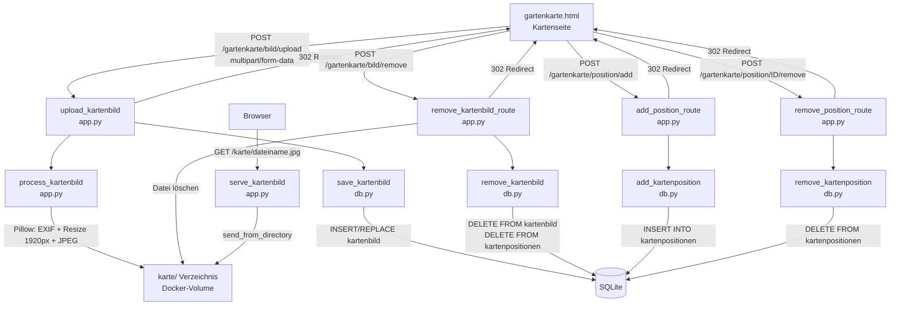

# Design-Dokument: Gartenkarte

## Übersicht

Diese Funktion erweitert den Garten-Tracker um eine visuelle Gartenkarte, auf der Pflanzen frei positioniert werden können. Als Hintergrund dient ein vom Benutzer hochgeladenes Bild (Foto oder Skizze des Gartens von oben). Pflanzen aus der bestehenden Pflanzenliste werden per Klick auf dem Kartenbild platziert — die Klick-Koordinaten werden als relative Prozentwerte (0.0–100.0) gespeichert, sodass die Markierungen bei jeder Bildschirmgröße korrekt skalieren. Die Markierungen werden serverseitig als HTML-Elemente mit CSS `position: absolute` und Prozentwerten gerendert.

**Designentscheidungen:**

- Neue Route `/gartenkarte` mit eigenem Template `gartenkarte.html`.
- Zwei neue SQLite-Tabellen: `kartenbild` (max. 1 Zeile für das Hintergrundbild) und `kartenpositionen` (Pflanzenpositionen mit x/y-Prozentwerten).
- Kartenbild-Datei wird im Verzeichnis `{DB_PATH}/../karte/` gespeichert — neben der Datenbank im Docker-Volume `/data/karte/`.
- Dateiname: UUID4 + `.jpg` für Eindeutigkeit.
- Bildverarbeitung: Pillow `ImageOps.exif_transpose()` für EXIF-Rotation, `Image.thumbnail()` für proportionale Verkleinerung auf max. 1920px lange Seite, Speicherung als JPEG Qualität 85.
- Maximale Upload-Größe: 10 MB (bereits via `MAX_CONTENT_LENGTH` konfiguriert).
- Positionierung per Klick: minimales Inline-JavaScript erfasst die Klick-Koordinaten relativ zum Bild und schreibt sie in versteckte Formularfelder, die per POST gesendet werden.
- Markierungen: farbige Punkte (CSS) mit `title`-Attribut für den Pflanzennamen. Farbe aus dem `farbe`-Feld der Pflanze oder Standardfarbe.
- Entfernen einer Markierung: kleines Lösch-Formular pro Markierung (POST mit Redirect, PRG-Pattern).
- Beim Löschen des Kartenbildes werden alle Kartenpositionen mitgelöscht (explizit in der Lösch-Logik).
- Beim Löschen einer Pflanze greift ON DELETE CASCADE für die Kartenpositionen.
- Navigation: neuer Link „🗺️ Karte" in `base.html`.
- Migration: Schema-Version 5 in `_migrate()`.

## Architektur



```
Browser
  │
  ├── GET /gartenkarte                        → gartenkarte_page()
  │     ├── get_kartenbild() → Bild-Metadaten oder None
  │     ├── get_kartenpositionen() → Liste aller Positionen mit Pflanzendaten
  │     └── get_all_plants(aktiv) → Dropdown-Daten
  │
  ├── POST /gartenkarte/bild/upload           → upload_kartenbild()
  │     ├── Validierung (MIME, Datei vorhanden)
  │     ├── process_kartenbild() — EXIF + Resize 1920px + JPEG
  │     ├── Altes Bild löschen (falls vorhanden)
  │     ├── Datei speichern → karte/
  │     ├── save_kartenbild() → INSERT/REPLACE kartenbild
  │     └── redirect → /gartenkarte
  │
  ├── POST /gartenkarte/bild/remove           → remove_kartenbild_route()
  │     ├── get_kartenbild() → Metadaten
  │     ├── remove_kartenbild() → DELETE kartenbild + kartenpositionen
  │     ├── Datei löschen → karte/
  │     └── redirect → /gartenkarte
  │
  ├── POST /gartenkarte/position/add          → add_position_route()
  │     ├── Validierung (plant_id, x, y, Kartenbild vorhanden)
  │     ├── add_kartenposition() → INSERT kartenpositionen
  │     └── redirect → /gartenkarte
  │
  ├── POST /gartenkarte/position/<id>/remove  → remove_position_route()
  │     ├── remove_kartenposition() → DELETE FROM kartenpositionen
  │     └── redirect → /gartenkarte
  │
  └── GET /karte/<dateiname>                  → serve_kartenbild()
        └── send_from_directory(KARTE_DIR)
```

## Komponenten und Schnittstellen

### db.py — Änderungen

**Schema-Version:** `SCHEMA_VERSION = 5`

**Migration in `_migrate()` — neuer Block `if current < 5`:**
```python
if current < 5:
    conn.execute("""
        CREATE TABLE IF NOT EXISTS kartenbild (
            id        INTEGER PRIMARY KEY AUTOINCREMENT,
            dateiname TEXT    NOT NULL
        )
    """)
    conn.execute("""
        CREATE TABLE IF NOT EXISTS kartenpositionen (
            id       INTEGER PRIMARY KEY AUTOINCREMENT,
            plant_id INTEGER NOT NULL REFERENCES plants(id) ON DELETE CASCADE,
            x        REAL    NOT NULL,
            y        REAL    NOT NULL
        )
    """)
```

**Neue Funktionen:**

`get_kartenbild() -> dict | None`
- Gibt den einzigen Eintrag aus `kartenbild` zurück oder `None`.
- `SELECT id, dateiname FROM kartenbild LIMIT 1`

`save_kartenbild(dateiname: str) -> None`
- Löscht alle bestehenden Einträge und fügt den neuen ein (max. 1 Zeile).
- `DELETE FROM kartenbild` + `INSERT INTO kartenbild (dateiname) VALUES (?)`

`remove_kartenbild() -> None`
- Löscht den Kartenbild-Eintrag und alle Kartenpositionen.
- `DELETE FROM kartenpositionen` + `DELETE FROM kartenbild`
- Atomare Transaktion.

`get_kartenpositionen() -> list[dict]`
- Gibt alle Kartenpositionen mit Pflanzendaten zurück (JOIN auf `plants`).
- `SELECT kp.id, kp.plant_id, kp.x, kp.y, p.name, p.farbe FROM kartenpositionen kp JOIN plants p ON kp.plant_id = p.id ORDER BY kp.id`

`add_kartenposition(plant_id: int, x: float, y: float) -> None`
- Fügt eine neue Kartenposition ein.
- `INSERT INTO kartenpositionen (plant_id, x, y) VALUES (?, ?, ?)`

`remove_kartenposition(position_id: int) -> None`
- Löscht eine einzelne Kartenposition.
- `DELETE FROM kartenpositionen WHERE id = ?`

### app.py — Änderungen

**Neue Imports aus db.py:**
```python
from db import (..., get_kartenbild, save_kartenbild, remove_kartenbild,
                get_kartenpositionen, add_kartenposition, remove_kartenposition)
```

**Neue Konstanten:**
```python
MAX_KARTE_DIMENSION = 1920
KARTE_DIR = Path(os.environ.get("DB_PATH", "/data/plants.db")).parent / "karte"
```

**Verzeichnis erstellen beim Start:**
```python
os.makedirs(KARTE_DIR, exist_ok=True)
```

**Hilfsfunktion `process_kartenbild(file_storage) -> bytes`:**
- Öffnet das Bild mit `Image.open()`.
- Wendet `ImageOps.exif_transpose()` an.
- Konvertiert zu RGB.
- Wenn die lange Seite > 1920px: `image.thumbnail((1920, 1920), Image.LANCZOS)`.
- Speichert als JPEG Qualität 85 in einen BytesIO-Buffer.
- Gibt die Bytes zurück.
- Bei `UnidentifiedImageError` oder anderen Pillow-Fehlern: wirft eine Exception.

**Hilfsfunktion `_render_karte_error(error: str, kartenbild=None, positionen=None, plants=None)`:**
- Rendert `gartenkarte.html` mit Fehlermeldung und HTTP 400.
- Lädt fehlende Daten nach (kartenbild, positionen, plants) falls nicht übergeben.

**Neue Routen:**

`GET /gartenkarte` → `gartenkarte_page()`
- Lädt `get_kartenbild()`, `get_kartenpositionen()`, `get_all_plants()`.
- Rendert `gartenkarte.html`.

`POST /gartenkarte/bild/upload` → `upload_kartenbild()`
1. Prüft ob Datei vorhanden (`request.files.get("bild")`).
2. Prüft MIME-Typ (`ALLOWED_MIME_TYPES`).
3. Ruft `process_kartenbild()` auf (try/except für Bildfehler).
4. Altes Kartenbild löschen: `get_kartenbild()` → falls vorhanden, Datei vom Dateisystem löschen.
5. Generiert UUID-Dateinamen, speichert Datei in `KARTE_DIR`.
6. Ruft `save_kartenbild(dateiname)` auf.
7. Bei Dateisystemfehler: Fehlermeldung zurückgeben, keine DB-Änderung.
8. Redirect auf `/gartenkarte`.

`POST /gartenkarte/bild/remove` → `remove_kartenbild_route()`
1. `get_kartenbild()` → falls None, Redirect auf `/gartenkarte`.
2. `remove_kartenbild()` — DB-Einträge löschen (kartenbild + kartenpositionen).
3. Datei vom Dateisystem löschen (Fehler ignorieren falls Datei fehlt).
4. Redirect auf `/gartenkarte`.

`POST /gartenkarte/position/add` → `add_position_route()`
1. Prüft ob Kartenbild vorhanden (`get_kartenbild()`).
2. Liest `plant_id`, `x`, `y` aus dem Formular.
3. Validiert `plant_id` (Pflanze muss existieren) → 404 wenn nicht.
4. Validiert `x` und `y` (0.0–100.0) → Fehlermeldung wenn ungültig.
5. `add_kartenposition(plant_id, x, y)`.
6. Redirect auf `/gartenkarte`.

`POST /gartenkarte/position/<int:position_id>/remove` → `remove_position_route(position_id)`
1. `remove_kartenposition(position_id)`.
2. Redirect auf `/gartenkarte`.

`GET /karte/<path:dateiname>` → `serve_kartenbild(dateiname)`
- `send_from_directory(KARTE_DIR, dateiname)`.

**Änderung an `_safe_next()`:**
- Fügt `/gartenkarte` zu den erlaubten Pfaden hinzu.

### templates/gartenkarte.html — Neues Template

Erweitert `base.html`. Struktur:

```html


<h2>🗺️ Gartenkarte</h2>


<div class="alert-error">{{ error }}</div>



  {# Karten-Container mit relativem Positioning #}
  <div class="karte-container">
    <div class="karte-bild-wrap" id="karte-wrap">
      

      {# Markierungen als absolute-positionierte Elemente #}
      
      <div class="karte-marker"
           style="left:{{ pos.x }}%;top:{{ pos.y }}%;background:{{ pos.farbe }};"
           title="{{ pos.name }}">
        <form method="post" action="/gartenkarte/position/{{ pos.id }}/remove" class="marker-remove">
          <button type="submit" class="marker-remove-btn" title="Entfernen">×</button>
        </form>
      </div>
      
    </div>

    {# Pflanze platzieren #}
    <div class="karte-controls">
      <form method="post" action="/gartenkarte/position/add" id="position-form">
        <div class="form-inline-row">
          <select name="plant_id" required>
            <option value="">Pflanze wählen…</option>
            
            <option value="{{ p.id }}">{{ p.name }}</option>
            
          </select>
          <input type="hidden" name="x" id="karte-x">
          <input type="hidden" name="y" id="karte-y">
          <span class="karte-hint" id="karte-hint">Pflanze wählen, dann auf die Karte klicken.</span>
        </div>
      </form>
    </div>

    {# Kartenbild ersetzen / löschen #}
    <div class="karte-actions">
      <form method="post" action="/gartenkarte/bild/upload" enctype="multipart/form-data" class="form-inline-row">
        <input type="file" name="bild" accept="image/jpeg,image/png" required>
        <button type="submit" class="btn btn-outline btn-sm">🔄 Bild ersetzen</button>
      </form>
      <form method="post" action="/gartenkarte/bild/remove" style="display:inline">
        <button type="submit" class="btn btn-danger btn-sm"
                onclick="return confirm('Kartenbild und alle Positionen wirklich löschen?')">🗑️ Bild löschen</button>
      </form>
    </div>
  </div>

  {# Minimales Inline-JS für Klick-Koordinaten #}
  <script>
  (function(){
    var wrap = document.getElementById('karte-wrap');
    var img = document.getElementById('karte-bild');
    var form = document.getElementById('position-form');
    var xInput = document.getElementById('karte-x');
    var yInput = document.getElementById('karte-y');
    var hint = document.getElementById('karte-hint');
    wrap.addEventListener('click', function(e){
      if(e.target.closest('.marker-remove')) return;
      var rect = img.getBoundingClientRect();
      var x = ((e.clientX - rect.left) / rect.width * 100).toFixed(2);
      var y = ((e.clientY - rect.top) / rect.height * 100).toFixed(2);
      if(x < 0 || x > 100 || y < 0 || y > 100) return;
      xInput.value = x;
      yInput.value = y;
      if(form.querySelector('select').value){
        form.submit();
      } else {
        hint.textContent = 'Bitte zuerst eine Pflanze wählen.';
      }
    });
  })();
  </script>


  {# Kein Kartenbild — Upload-Formular #}
  <div class="card">
    <div class="empty-state">
      <div class="icon">🗺️</div>
      <p>Noch kein Kartenbild vorhanden.</p>
      <p style="color:var(--text-muted);font-size:.85rem;margin-top:.5rem">
        Lade ein Foto oder eine Skizze deines Gartens hoch.
      </p>
    </div>
    <form method="post" action="/gartenkarte/bild/upload" enctype="multipart/form-data">
      <div class="form-inline-row" style="justify-content:center;margin-top:1rem">
        <input type="file" name="bild" accept="image/jpeg,image/png" required>
        <button type="submit" class="btn btn-primary">📷 Kartenbild hochladen</button>
      </div>
    </form>
  </div>



```

### templates/base.html — Änderung

Neuer Navigationslink in der Header-Navigation:
```html
<a href="/gartenkarte" class="nav-link nav-active">🗺️ Karte</a>
```

### static/style.css — Neue Styles

```css
/* ── Gartenkarte ────────────────────────────────────────────── */
.karte-container {
  margin-bottom: 2rem;
}

.karte-bild-wrap {
  position: relative;
  display: inline-block;
  width: 100%;
  cursor: crosshair;
}

.karte-bild {
  width: 100%;
  height: auto;
  display: block;
  border-radius: var(--radius);
  border: 2px solid var(--border);
}

.karte-marker {
  position: absolute;
  width: 20px;
  height: 20px;
  border-radius: 50%;
  background: var(--green-mid);
  border: 2px solid var(--white);
  box-shadow: 0 1px 4px rgba(0,0,0,.3);
  transform: translate(-50%, -50%);
  z-index: 2;
}

.karte-marker:hover .marker-remove {
  display: block;
}

.marker-remove {
  display: none;
  position: absolute;
  top: -8px;
  right: -8px;
}

.marker-remove-btn {
  width: 18px;
  height: 18px;
  border-radius: 50%;
  border: none;
  background: var(--danger);
  color: var(--white);
  font-size: 12px;
  line-height: 1;
  cursor: pointer;
  padding: 0;
  display: flex;
  align-items: center;
  justify-content: center;
}

.karte-controls {
  margin-top: 1rem;
}

.karte-hint {
  font-size: .85rem;
  color: var(--text-muted);
}

.karte-actions {
  margin-top: 1rem;
  display: flex;
  gap: .75rem;
  flex-wrap: wrap;
  align-items: center;
}

@media (max-width: 599px) {
  .karte-marker {
    width: 16px;
    height: 16px;
  }

  .karte-controls,
  .karte-actions {
    flex-direction: column;
    align-items: stretch;
  }
}
```

## Datenmodelle

### Neue Tabelle `kartenbild`

```sql
CREATE TABLE IF NOT EXISTS kartenbild (
    id        INTEGER PRIMARY KEY AUTOINCREMENT,
    dateiname TEXT    NOT NULL
);
```

| Spalte | Typ | Beschreibung |
|--------|-----|--------------|
| `id` | INTEGER PK | Auto-Increment Primärschlüssel |
| `dateiname` | TEXT NOT NULL | UUID-basierter Dateiname (z.B. `a1b2c3d4-...-e5f6.jpg`) |

Maximal 1 Zeile — erzwungen durch die Anwendungslogik (`DELETE` vor `INSERT` in `save_kartenbild()`).

### Neue Tabelle `kartenpositionen`

```sql
CREATE TABLE IF NOT EXISTS kartenpositionen (
    id       INTEGER PRIMARY KEY AUTOINCREMENT,
    plant_id INTEGER NOT NULL REFERENCES plants(id) ON DELETE CASCADE,
    x        REAL    NOT NULL,
    y        REAL    NOT NULL
);
```

| Spalte | Typ | Beschreibung |
|--------|-----|--------------|
| `id` | INTEGER PK | Auto-Increment Primärschlüssel |
| `plant_id` | INTEGER FK | Fremdschlüssel auf `plants.id`, ON DELETE CASCADE |
| `x` | REAL NOT NULL | X-Position als Prozentwert (0.0–100.0) |
| `y` | REAL NOT NULL | Y-Position als Prozentwert (0.0–100.0) |

Dieselbe Pflanze kann mehrfach platziert werden (keine UNIQUE-Constraint auf `plant_id`).

### Dateisystem-Layout

```
/data/                      ← Docker-Volume
├── plants.db               ← SQLite-Datenbank
├── fotos/                  ← Foto-Verzeichnis (bestehend)
└── karte/                  ← Kartenbild-Verzeichnis (NEU)
    └── a1b2c3d4-...-e5f6.jpg
```

### Schema-Übersicht (nach Migration V5)

```
plants          (unverändert)
ereignisse      (unverändert)
beobachtungen   (unverändert)
phaenologie     (unverändert)
fotos           (unverändert)
kartenbild      ← NEU
  id            INTEGER PRIMARY KEY AUTOINCREMENT
  dateiname     TEXT NOT NULL
kartenpositionen ← NEU
  id            INTEGER PRIMARY KEY AUTOINCREMENT
  plant_id      INTEGER NOT NULL FK → plants(id) ON DELETE CASCADE
  x             REAL NOT NULL
  y             REAL NOT NULL
```

## Correctness Properties

*A property is a characteristic or behavior that should hold true across all valid executions of a system — essentially, a formal statement about what the system should do. Properties serve as the bridge between human-readable specifications and machine-verifiable correctness guarantees.*

**Property Reflection:** Nach der Prework-Analyse wurden folgende Konsolidierungen vorgenommen:
- 2.1 (Verkleinerung > 1920px), 2.2 (keine Verkleinerung ≤ 1920px) und 2.3 (JPEG-Format) werden zu einer Property über Bildverarbeitung kombiniert.
- 1.2 (Upload speichert Datei) und 8.1 (Datei in karte/) sind redundant — eine Upload-Property.
- 1.3 (Redirect nach Upload) und 6.3 (Redirect nach Entfernen) werden zu einer Redirect-Property kombiniert.
- 1.4 und 1.5 (MIME-Validierung) sind redundant — eine MIME-Property.
- 3.2 und 8.3 (Ersetzen löscht alte Datei) sind redundant — eine Ersetzungs-Property.
- 3.4 und 3.5 (Löschen entfernt Positionen) werden zu einer Lösch-Property kombiniert.
- 4.3 und 4.4 (Position speichern mit korrekten Koordinaten) werden kombiniert.
- 4.6 (gleiche Pflanze mehrfach) ist durch 4.3 impliziert (keine UNIQUE-Constraint).
- 5.1–5.5 (Markierungen anzeigen mit Position, Name, Farbe) werden zu einer Marker-Rendering-Property kombiniert.

---

### Property 1: Bildverkleinerung und JPEG-Konvertierung

*For any* gültiges Eingabebild (JPEG oder PNG) mit beliebigen Dimensionen, nach der Verarbeitung durch `process_kartenbild()` SHALL das Ergebnis ein gültiges JPEG sein, und die lange Seite SHALL `min(original_lange_seite, 1920)` Pixel betragen, wobei das Seitenverhältnis proportional erhalten bleibt.

**Validates: Requirements 2.1, 2.2, 2.3**

---

### Property 2: Upload speichert Kartenbild korrekt

*For any* gültiges Bild (JPEG oder PNG), nach einem erfolgreichen Upload SHALL genau eine Datei im `karte/`-Verzeichnis existieren und genau ein Eintrag in der Tabelle `kartenbild` vorhanden sein, dessen `dateiname` der gespeicherten Datei entspricht.

**Validates: Requirements 1.2, 8.1**

---

### Property 3: Nur gültige MIME-Typen werden akzeptiert

*For any* Datei mit einem MIME-Typ außerhalb von `{image/jpeg, image/png}`, der Upload SHALL abgelehnt werden und die Fehlermeldung „Nur JPEG- und PNG-Dateien sind erlaubt." SHALL angezeigt werden.

**Validates: Requirements 1.4, 1.5**

---

### Property 4: Kartenbild ersetzen löscht alte Datei

*For any* Sequenz von zwei Kartenbild-Uploads, nach dem zweiten Upload SHALL die Datei des ersten Uploads nicht mehr im Dateisystem existieren, und die Tabelle `kartenbild` SHALL genau einen Eintrag mit dem Dateinamen des zweiten Uploads enthalten.

**Validates: Requirements 3.2, 8.3**

---

### Property 5: Kartenbild löschen entfernt Bild und alle Positionen

*For any* Kartenbild mit 0–N zugehörigen Kartenpositionen, nach dem Löschen des Kartenbildes SHALL weder eine Datei im `karte/`-Verzeichnis noch ein Eintrag in `kartenbild` noch Einträge in `kartenpositionen` existieren.

**Validates: Requirements 3.4, 3.5**

---

### Property 6: Position speichern mit korrekten Koordinaten

*For any* gültige Pflanzen-ID und Koordinaten x, y ∈ [0.0, 100.0], nach dem Speichern einer Kartenposition SHALL ein Eintrag in `kartenpositionen` existieren, dessen `plant_id`, `x` und `y` den übermittelten Werten entsprechen.

**Validates: Requirements 4.3, 4.4**

---

### Property 7: Markierungen korrekt gerendert

*For any* Menge von Kartenpositionen mit zugehörigen Pflanzendaten, die Gartenkarte SHALL für jede Position ein Marker-Element mit `left:x%;top:y%` im Style-Attribut, dem Pflanzennamen als `title`-Attribut und — falls die Pflanze eine Farbe hat — `background:farbe` im Style-Attribut enthalten.

**Validates: Requirements 5.1, 5.2, 5.3, 5.4, 5.5**

---

### Property 8: Position entfernen löscht DB-Eintrag

*For any* existierende Kartenposition, nach dem Entfernen über `POST /gartenkarte/position/<id>/remove` SHALL kein Eintrag mit dieser ID in `kartenpositionen` existieren.

**Validates: Requirements 6.2**

---

### Property 9: Pflanze löschen entfernt alle zugehörigen Kartenpositionen

*For any* Pflanze mit 0–N Kartenpositionen, nach dem Löschen der Pflanze SHALL kein Eintrag in `kartenpositionen` mit der `plant_id` dieser Pflanze existieren.

**Validates: Requirements 6.4**

---

### Property 10: Maximal ein Kartenbild-Eintrag

*For any* Sequenz von Upload- und Lösch-Operationen auf dem Kartenbild, zu jedem Zeitpunkt SHALL die Tabelle `kartenbild` höchstens einen Eintrag enthalten.

**Validates: Requirements 7.3**

---

### Property 11: Ungültige Koordinaten werden abgelehnt

*For any* Koordinaten x oder y außerhalb des Bereichs [0.0, 100.0], der Positionierungs-Service SHALL die Anfrage ablehnen und die Fehlermeldung „Ungültige Koordinaten." zurückgeben.

**Validates: Requirements 11.3**

---

### Property 12: Redirect nach Karten-Operationen

*For any* erfolgreiche Karten-Operation (Bild-Upload, Bild-Löschen, Position hinzufügen, Position entfernen) SHALL die Anwendung einen HTTP-302-Redirect auf `/gartenkarte` zurückgeben.

**Validates: Requirements 1.3, 6.3**

---

## Fehlerbehandlung

| Fehlerfall | Verhalten |
|---|---|
| POST `/gartenkarte/bild/upload` ohne Datei | Fehlermeldung „Bitte eine Bilddatei auswählen." + HTTP 400 |
| POST `/gartenkarte/bild/upload` mit ungültigem MIME-Typ | Fehlermeldung „Nur JPEG- und PNG-Dateien sind erlaubt." + HTTP 400 |
| POST `/gartenkarte/bild/upload` mit beschädigter Bilddatei | Fehlermeldung „Das Bild konnte nicht verarbeitet werden." + HTTP 400 |
| POST `/gartenkarte/bild/upload` mit Datei > 10 MB | Flask `RequestEntityTooLarge` |
| Dateisystemfehler beim Speichern des Kartenbildes | Fehlermeldung „Fehler beim Speichern der Datei." + HTTP 400, kein DB-Eintrag |
| POST `/gartenkarte/position/add` mit nicht existierender Pflanze | `abort(404)` — HTTP 404 |
| POST `/gartenkarte/position/add` mit ungültigen Koordinaten | Fehlermeldung „Ungültige Koordinaten." + HTTP 400 |
| POST `/gartenkarte/position/add` ohne Kartenbild | Fehlermeldung „Bitte zuerst ein Kartenbild hochladen." + HTTP 400 |
| Dateisystemfehler beim Löschen des Kartenbildes | DB-Einträge werden trotzdem gelöscht; Dateifehler wird ignoriert |

**Fehlerbehandlungsstrategie:**
- Alle Fehlermeldungen werden als `error`-Variable an `_render_karte_error()` übergeben.
- Reihenfolge bei Upload: 1) Validierung → 2) Bildverarbeitung → 3) Altes Bild löschen → 4) Datei schreiben → 5) DB-Insert. Bei Fehler in Schritt 4 wird kein DB-Eintrag erstellt.
- Reihenfolge bei Löschen: 1) DB-Einträge löschen → 2) Datei löschen. Dateifehler werden ignoriert.

## Testing-Strategie

### Ansatz

Die Kernlogik umfasst Bildverarbeitung (`process_kartenbild`), Koordinaten-Validierung, DB-Operationen (CRUD für Kartenbild und Positionen) und Template-Rendering (Marker-Positionierung). Property-Based Testing ist geeignet für die Bildverarbeitung (universelle Eigenschaften über beliebige Bildgrößen), die Koordinaten-Validierung und die Marker-Rendering-Logik. Die DB-Operationen und Route-Tests nutzen eine Mischung aus Property- und Example-Based Tests.

**PBT-Bibliothek:** [Hypothesis](https://hypothesis.readthedocs.io/) (Python, bereits im Projekt vorhanden)

### Property-Based Tests (Hypothesis, min. 100 Iterationen je Property)

| Test | Property | Beschreibung |
|------|----------|--------------|
| `test_kartenbild_resize_and_jpeg` | Property 1 | Zufällige Bildgrößen → lange Seite = min(original, 1920), Ergebnis ist JPEG |
| `test_upload_stores_kartenbild` | Property 2 | Zufällige gültige Bilder → Datei in karte/ und DB-Eintrag vorhanden |
| `test_invalid_mime_rejected` | Property 3 | Zufällige ungültige MIME-Typen → Upload abgelehnt |
| `test_replace_deletes_old_file` | Property 4 | Zwei Uploads → alte Datei gelöscht, neue vorhanden |
| `test_delete_removes_image_and_positions` | Property 5 | Kartenbild mit Positionen → nach Löschen alles weg |
| `test_position_stored_correctly` | Property 6 | Zufällige gültige Koordinaten → korrekt in DB gespeichert |
| `test_markers_rendered_correctly` | Property 7 | Zufällige Positionen → korrekte CSS-Positionierung und Attribute im HTML |
| `test_position_remove_deletes_entry` | Property 8 | Zufällige Position → nach Entfernen kein DB-Eintrag |
| `test_plant_delete_cascades_positions` | Property 9 | Pflanze mit Positionen → nach Löschen keine Positionen |
| `test_max_one_kartenbild_row` | Property 10 | Mehrere Uploads → immer max. 1 Zeile in kartenbild |
| `test_invalid_coordinates_rejected` | Property 11 | Zufällige ungültige Koordinaten → Anfrage abgelehnt |
| `test_redirect_after_karte_ops` | Property 12 | Zufällige Karten-Operationen → 302 Redirect auf /gartenkarte |

Tag-Format: `# Feature: gartenkarte, Property {N}: {property_text}`

### Example-Based Tests (pytest)

| Test | Anforderung | Beschreibung |
|------|-------------|--------------|
| `test_upload_form_when_no_image` | 1.1 | GET /gartenkarte ohne Kartenbild → Upload-Formular angezeigt |
| `test_no_file_error` | 1.6 | POST ohne Datei → Fehlermeldung |
| `test_exif_rotation` | 2.4 | Bild mit EXIF-Rotation → korrekte Orientierung |
| `test_replace_button_present` | 3.1 | GET /gartenkarte mit Kartenbild → Ersetzen-Button vorhanden |
| `test_delete_button_present` | 3.3 | GET /gartenkarte mit Kartenbild → Löschen-Button vorhanden |
| `test_dropdown_shows_active_plants` | 4.1 | GET /gartenkarte mit Kartenbild → Dropdown mit aktiven Pflanzen |
| `test_nonexistent_plant_404` | 4.5 | POST mit ungültiger plant_id → HTTP 404 |
| `test_remove_button_per_marker` | 6.1 | GET /gartenkarte mit Positionen → Entfernen-Button pro Markierung |
| `test_nav_link_present` | 9.1 | GET / → Navigationslink „🗺️ Karte" vorhanden |
| `test_nav_link_active` | 9.3 | GET /gartenkarte → nav-active Klasse auf Karte-Link |
| `test_no_kartenbild_position_error` | 11.4 | POST Position ohne Kartenbild → Fehlermeldung |
| `test_corrupt_image_error` | 11.2 | Beschädigte Datei → Fehlermeldung |

### Smoke-Tests

| Test | Anforderung | Beschreibung |
|------|-------------|--------------|
| `test_migration_creates_tables` | 7.1, 7.2, 7.4 | Nach init_db() existieren Tabellen kartenbild und kartenpositionen mit korrekten Spalten |

### Integrations-Tests

| Test | Anforderung | Beschreibung |
|------|-------------|--------------|
| `test_serve_kartenbild_route` | — | GET /karte/<dateiname> liefert Bild mit Status 200 |
| `test_filesystem_error_no_partial_db` | 11.1 | Simulierter Dateisystemfehler → kein DB-Eintrag |
