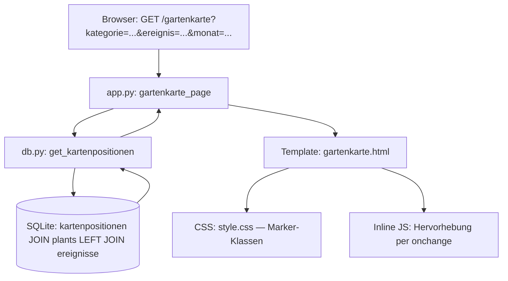

# Design: Karten-Optimierung

## Übersicht

Dieses Feature erweitert die bestehende Gartenkarte (`/gartenkarte`) um vier Verbesserungen:

1. **Filter-Leiste** mit Dropdowns für Kategorie, Ereignistyp und Monat — analog zu den bestehenden Filter-Leisten auf `/`, `/beobachtungen` und `/ereignisse`
2. **Vergrößerte runde Markierungen** (40px) für Pflanzen der Kategorie „Gehölze"
3. **Eckige vergrößerte Markierungen** (40px) für Pflanzen der Kategorie „Gartenpflege"
4. **Hervorhebung** der ausgewählten Pflanze durch 50% Transparenz aller anderen Markierungen

Alle Änderungen folgen den bestehenden Architekturmustern: serverseitiges Filtern in der Route, erweiterte SQL-Abfrage in `db.py`, Jinja2-Template-Rendering und minimales Inline-JavaScript.

## Architektur

Die Änderungen betreffen drei Schichten:



**Datenfluss:**
1. Browser sendet GET-Request mit optionalen Filterparametern
2. Route `gartenkarte_page()` liest Filter aus `request.args`
3. `get_kartenpositionen()` liefert Positionen mit `kategorie` und `aktiv`
4. Route filtert serverseitig (Kategorie direkt, Ereignistyp/Monat über Ereignis-Lookup)
5. Template rendert Filter-Leiste + Markierungen mit kategoriespezifischen CSS-Klassen + `data-plant-id`
6. Inline-JS steuert Hervorhebung beim Ändern der Pflanzen-Auswahl

## Komponenten und Schnittstellen

### 1. Datenbank-Schicht (`db.py`)

**Geänderte Funktion: `get_kartenpositionen()`**

Erweitert die bestehende Abfrage um `p.kategorie` und `p.aktiv`:

```python
def get_kartenpositionen() -> list[dict]:
    with get_db() as conn:
        rows = conn.execute(
            "SELECT kp.id, kp.plant_id, kp.x, kp.y, "
            "p.name, p.farbe, p.kategorie, p.aktiv "
            "FROM kartenpositionen kp "
            "JOIN plants p ON kp.plant_id = p.id "
            "ORDER BY kp.id"
        ).fetchall()
    return [dict(r) for r in rows]
```

Keine neue Funktion nötig — die Filterung erfolgt in der Route (konsistent mit `beobachtungen_page()` und `ereignisse_page()`).

### 2. Route-Schicht (`app.py`)

**Geänderte Route: `gartenkarte_page()`**

```python
@app.route("/gartenkarte")
def gartenkarte_page():
    kartenbild = get_kartenbild()
    positionen = get_kartenpositionen()
    plants = get_all_plants()

    # Nur aktive Pflanzen anzeigen
    positionen = [p for p in positionen if p.get("aktiv", 1) == 1]

    filter_kategorie = request.args.get("kategorie", "")
    filter_ereignis = request.args.get("ereignis", "")
    filter_monat = request.args.get("monat", "")

    # Filter: Kategorie
    if filter_kategorie:
        positionen = [p for p in positionen if p.get("kategorie") == filter_kategorie]

    # Filter: Ereignistyp + Monat (benötigt Ereignis-Lookup)
    if filter_ereignis or filter_monat:
        ereignisse = get_all_ereignisse()
        plant_ids_mit_ereignis = _filter_plant_ids_by_ereignis(
            ereignisse, filter_ereignis, filter_monat
        )
        positionen = [p for p in positionen if p["plant_id"] in plant_ids_mit_ereignis]

    return render_template("gartenkarte.html",
                           kartenbild=kartenbild,
                           positionen=positionen,
                           plants=plants,
                           german_months=GERMAN_MONTHS,
                           valid_kategorien=VALID_KATEGORIEN,
                           valid_ereignistypen=sorted(VALID_EREIGNISTYPEN),
                           filter_kategorie=filter_kategorie,
                           filter_ereignis=filter_ereignis,
                           filter_monat=filter_monat)
```

**Neue Hilfsfunktion: `_filter_plant_ids_by_ereignis()`**

Extrahiert die plant_ids, die den Ereignistyp-/Monats-Filtern entsprechen. Wiederverwendet die gleiche Logik wie in `beobachtungen_page()` und `ereignisse_page()`:

```python
def _filter_plant_ids_by_ereignis(ereignisse, filter_ereignis, filter_monat):
    if filter_ereignis:
        ereignisse = [e for e in ereignisse if e["ereignistyp"] == filter_ereignis]
    if filter_monat:
        try:
            fm = int(filter_monat)
        except ValueError:
            fm = None
        if fm and 1 <= fm <= 12:
            ereignisse = [e for e in ereignisse if e["startmonat"] <= fm <= e["endmonat"]]
    return {e["plant_id"] for e in ereignisse}
```

### 3. Template-Schicht (`templates/gartenkarte.html`)

**Neue Filter-Leiste** — eingefügt oberhalb des Karten-Containers, nur wenn `kartenbild` vorhanden. Verwendet exakt das gleiche HTML-Muster wie `beobachtungen.html`:

```html
<div class="card" style="margin-bottom:1rem">
  <form method="get" action="/gartenkarte" class="filter-bar">
    <!-- Kategorie, Ereignistyp, Monat Dropdowns -->
    <!-- "Filter zurücksetzen" Link wenn Filter aktiv -->
  </form>
</div>
```

**Erweiterte Markierungen** — kategoriespezifische CSS-Klassen und `data-plant-id`:

```html
<div class="karte-marker karte-marker-gehoelz karte-marker-gartenpflege"
     style="left:{{ pos.x }}%;top:{{ pos.y }}%;background:{{ pos.farbe }};"
     data-plant-id="{{ pos.plant_id }}"
     title="{{ pos.name }}">
```

**Hervorhebungs-JavaScript** — ergänzt das bestehende Inline-Script:

```javascript
var sel = form.querySelector('select');
sel.addEventListener('change', function() {
  var pid = sel.value;
  document.querySelectorAll('.karte-marker').forEach(function(m) {
    m.style.opacity = (!pid || m.dataset.plantId == pid) ? '1' : '0.5';
  });
});
```

### 4. CSS-Schicht (`static/style.css`)

Zwei neue Klassen im Gartenkarte-Abschnitt:

```css
.karte-marker-gehoelz {
  width: 40px;
  height: 40px;
  border-radius: 50%;
}

.karte-marker-gartenpflege {
  width: 40px;
  height: 40px;
  border-radius: 0;
}
```

Mobile-Anpassung (bestehender `@media`-Block):

```css
.karte-marker-gehoelz {
  width: 32px;
  height: 32px;
}
.karte-marker-gartenpflege {
  width: 32px;
  height: 32px;
}
```

## Datenmodell

Keine Schema-Änderungen nötig. Die bestehenden Tabellen `kartenpositionen` und `plants` enthalten bereits alle benötigten Felder. Die Erweiterung betrifft nur die SQL-Abfrage (zusätzliche Spalten `kategorie`, `aktiv` im SELECT).

**Bestehende relevante Tabellen:**

```
kartenpositionen: id, plant_id (FK), x, y
plants: id, name, kategorie, farbe, aktiv, ...
ereignisse: id, plant_id (FK), ereignistyp, startmonat, endmonat, ...
```

**Erweiterte Rückgabe von `get_kartenpositionen()`:**

| Feld | Typ | Quelle | Neu? |
|------|-----|--------|------|
| id | int | kartenpositionen.id | Nein |
| plant_id | int | kartenpositionen.plant_id | Nein |
| x | float | kartenpositionen.x | Nein |
| y | float | kartenpositionen.y | Nein |
| name | str | plants.name | Nein |
| farbe | str | plants.farbe | Nein |
| kategorie | str | plants.kategorie | **Ja** |
| aktiv | int | plants.aktiv | **Ja** |


## Correctness Properties

*A property is a characteristic or behavior that should hold true across all valid executions of a system — essentially, a formal statement about what the system should do. Properties serve as the bridge between human-readable specifications and machine-verifiable correctness guarantees.*

### Property 1: Filterung liefert nur passende Positionen

*For any* Kombination von Filterparametern (Kategorie, Ereignistyp, Monat) und *for any* Menge von Pflanzen mit Kartenpositionen und Ereignissen: die gefilterte Positionsliste SHALL ausschließlich Positionen enthalten, deren zugehörige Pflanze (a) der gewählten Kategorie entspricht (falls Kategorie-Filter gesetzt), (b) mindestens ein Ereignis des gewählten Typs besitzt (falls Ereignistyp-Filter gesetzt), und (c) mindestens ein Ereignis besitzt, dessen Zeitraum den gewählten Monat einschließt (falls Monats-Filter gesetzt).

**Validates: Requirements 1.5, 1.6, 1.7, 1.8, 5.3**

### Property 2: Kategoriespezifische Marker-Klassen

*For any* Pflanze mit einer Kartenposition: wenn die Kategorie „Gehölze" ist, SHALL die gerenderte Markierung die CSS-Klasse `karte-marker-gehoelz` enthalten; wenn die Kategorie „Gartenpflege" ist, SHALL die Markierung die CSS-Klasse `karte-marker-gartenpflege` enthalten; für alle anderen Kategorien SHALL keine dieser Zusatzklassen vorhanden sein.

**Validates: Requirements 2.1, 2.3, 3.1, 3.3**

### Property 3: data-plant-id Attribut auf Markierungen

*For any* Pflanze mit einer Kartenposition: die gerenderte Markierung SHALL ein `data-plant-id`-Attribut besitzen, dessen Wert der `plant_id` der Position entspricht.

**Validates: Requirements 4.5**

### Property 4: Erweiterte Abfrage liefert kategorie und aktiv

*For any* Pflanze mit einer Kartenposition: der von `get_kartenpositionen()` zurückgegebene Datensatz SHALL die Felder `kategorie` und `aktiv` enthalten, und deren Werte SHALL mit den entsprechenden Feldern der `plants`-Tabelle übereinstimmen.

**Validates: Requirements 5.1, 5.2**

### Property 5: Nur aktive Pflanzen auf der Karte

*For any* Menge von Pflanzen (aktiv und inaktiv) mit Kartenpositionen: die Gartenkarte SHALL ausschließlich Markierungen für aktive Pflanzen (aktiv = 1) anzeigen.

**Validates: Requirements 5.4**

## Fehlerbehandlung

| Szenario | Verhalten |
|----------|-----------|
| Ungültiger Monats-Filterwert (nicht 1–12) | Filter wird ignoriert, alle Positionen angezeigt |
| Ungültiger Kategorie-Filterwert (nicht in VALID_KATEGORIEN) | Leere Positionsliste (kein Match) |
| Keine Positionen nach Filterung | Karte wird ohne Markierungen angezeigt (kein leerer Zustand nötig — das Kartenbild bleibt sichtbar) |
| Pflanze im Dropdown hat keine Position | Hervorhebungs-JS findet keine Markierung mit passender plant_id → alle Markierungen werden halbtransparent |
| `get_all_ereignisse()` liefert leere Liste | Ereignistyp-/Monats-Filter ergeben leere plant_id-Menge → keine Markierungen |

Die bestehende Fehlerbehandlung für Kartenbild-Upload, Position-Hinzufügen und Position-Entfernen bleibt unverändert.

## Teststrategie

### Property-Based Tests (Hypothesis)

Bibliothek: `hypothesis` (bereits im Projekt vorhanden)

Jeder Property-Test wird mit mindestens 100 Iterationen ausgeführt. Tests werden in `tests/test_karten_optimierung_properties.py` implementiert.

**Zu testende Properties:**

1. **Filterung** (Property 1): Generiere zufällige Pflanzen mit Kategorien, Ereignissen und Kartenpositionen. Wende zufällige Filterkombinationen an. Verifiziere, dass nur passende Positionen zurückgegeben werden.
   - Tag: `Feature: karten-optimierung, Property 1: Filterung liefert nur passende Positionen`

2. **Marker-Klassen** (Property 2): Generiere zufällige Pflanzen mit verschiedenen Kategorien und Positionen. Rendere die Seite. Verifiziere korrekte CSS-Klassen im HTML.
   - Tag: `Feature: karten-optimierung, Property 2: Kategoriespezifische Marker-Klassen`

3. **data-plant-id** (Property 3): Generiere zufällige Pflanzen mit Positionen. Rendere die Seite. Verifiziere `data-plant-id`-Attribute.
   - Tag: `Feature: karten-optimierung, Property 3: data-plant-id Attribut auf Markierungen`

4. **Erweiterte Abfrage** (Property 4): Generiere zufällige Pflanzen mit verschiedenen Kategorien und aktiv-Status. Erstelle Positionen. Rufe `get_kartenpositionen()` auf. Verifiziere, dass `kategorie` und `aktiv` korrekt zurückgegeben werden.
   - Tag: `Feature: karten-optimierung, Property 4: Erweiterte Abfrage liefert kategorie und aktiv`

5. **Nur aktive Pflanzen** (Property 5): Generiere zufällige Pflanzen (aktiv/inaktiv) mit Positionen. Rufe die Route auf. Verifiziere, dass nur aktive Pflanzen-Markierungen im HTML erscheinen.
   - Tag: `Feature: karten-optimierung, Property 5: Nur aktive Pflanzen auf der Karte`

### Beispiel-basierte Tests

- Filter-Leiste wird angezeigt wenn Kartenbild vorhanden (Req 1.1)
- Dropdown-Inhalte korrekt (Req 1.2, 1.3, 1.4)
- Filterwerte bleiben nach Seitenneuladen erhalten (Req 1.9)
- CSS-Klasse `karte-marker-gehoelz` hat `border-radius: 50%` (Req 2.2)
- CSS-Klasse `karte-marker-gartenpflege` hat `border-radius: 0` (Req 3.2)
- Hervorhebungs-JS vorhanden mit `onchange` (Req 4.4)
- Filter-Leiste verwendet gleiche CSS-Klassen wie andere Seiten (Req 1.10)

### Testinfrastruktur

Die Tests verwenden das bestehende Muster aus `test_gartenkarte_properties.py`:
- `tempfile.TemporaryDirectory()` + `importlib.reload()` für DB-Isolation
- Flask-Test-Client für Route-Tests
- Direkte DB-Funktionsaufrufe für Datenbank-Layer-Tests
