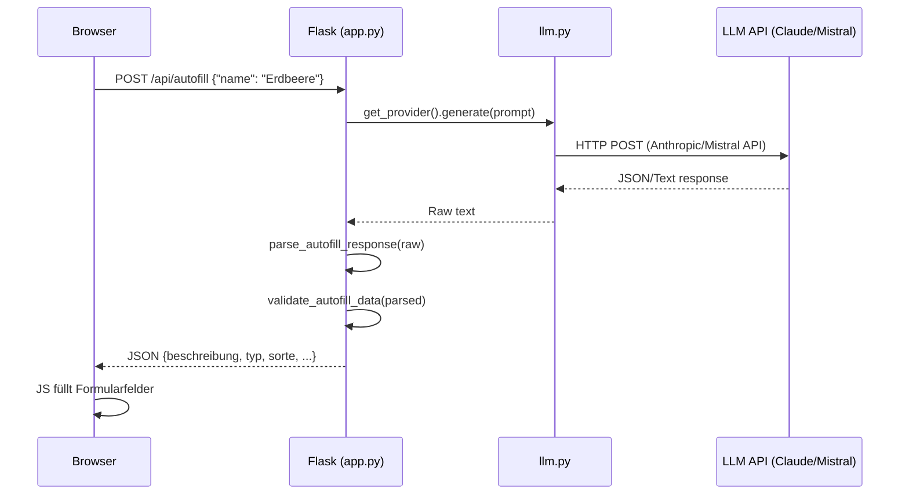

# Design Document: KI-Pflanzendaten

## Overview

Dieses Feature ergänzt den Garten-Tracker um eine KI-gestützte Autofill-Funktion für Pflanzendaten. Beim Anlegen oder Bearbeiten einer Pflanze kann der Benutzer per Button einen LLM-Aufruf auslösen, der strukturierte Pflanzendaten (Beschreibung, Typ, Sorte, Lichtbedarf, Lebensdauer, Kategorie, Ereignisse) zurückgibt und die Formularfelder automatisch befüllt.

Die bestehende LLM-Provider-Abstraktion aus `monthly_report.py` wird in ein gemeinsames Modul (`llm.py`) extrahiert, sodass sowohl der monatliche Newsletter als auch die Autofill-Funktion dieselbe Konfiguration nutzen. Die Seed-Scripts werden entfernt, da die KI-Autofill-Funktion deren Zweck ersetzt.

### Designentscheidungen

1. **Shared LLM-Modul statt Duplizierung**: Die Provider-Klassen werden in `llm.py` extrahiert. `monthly_report.py` und `app.py` importieren von dort.
2. **JSON-Endpunkt statt Server-Side-Rendering**: Der Autofill-Endpunkt gibt JSON zurück, damit das Formular per `fetch()` die Felder clientseitig befüllen kann — ohne Seiten-Reload.
3. **Graceful Degradation**: Wenn kein API-Key konfiguriert ist, wird der Autofill-Button gar nicht gerendert. Kein Feature-Bruch für Nutzer ohne LLM-Zugang.
4. **Validierung auf Server-Seite**: Die LLM-Antwort wird serverseitig gegen die bekannten Enum-Werte validiert. Ungültige Einzelfelder werden herausgefiltert, nicht die gesamte Antwort verworfen.
5. **Ereignisse als Vorschläge**: Auf der Edit-Seite werden KI-vorgeschlagene Ereignisse als übernehmbare Vorschläge angezeigt, nicht direkt eingefügt.

## Architecture



### Modulstruktur

```
├── llm.py              # NEU: Shared LLM-Provider (extrahiert aus monthly_report.py)
├── app.py              # Neuer Endpunkt POST /api/autofill + Autofill-Logik
├── monthly_report.py   # Importiert LLM-Provider aus llm.py (refactored)
├── templates/
│   ├── index.html      # Autofill-Button im "Pflanze hinzufügen"-Formular
│   └── edit.html       # Autofill-Button im Bearbeitungsformular
```

## Components and Interfaces

### 1. `llm.py` — Shared LLM-Provider-Modul

Extrahiert aus `monthly_report.py`. Enthält:

```python
# llm.py
from abc import ABC, abstractmethod
import os

LLM_PROVIDER = os.environ.get("LLM_PROVIDER", "claude").lower()
LLM_MODEL = os.environ.get("LLM_MODEL", "")

class LLMProvider(ABC):
    @abstractmethod
    def generate(self, prompt: str) -> str: ...
    @abstractmethod
    def validate_config(self) -> list[str]: ...
    @property
    @abstractmethod
    def name(self) -> str: ...

class ClaudeProvider(LLMProvider): ...
class MistralProvider(LLMProvider): ...

PROVIDERS: dict[str, type[LLMProvider]] = {
    "claude": ClaudeProvider,
    "mistral": MistralProvider,
}

def get_provider() -> LLMProvider:
    """Erstellt den konfigurierten LLM-Provider."""
    ...

def is_llm_configured() -> bool:
    """Prüft ob ein LLM-Provider mit gültigem API-Key konfiguriert ist."""
    ...
```

### 2. Autofill-Endpunkt in `app.py`

```python
@app.route("/api/autofill", methods=["POST"])
def api_autofill():
    """KI-Autofill: Gibt strukturierte Pflanzendaten als JSON zurück."""
    ...
```

**Request:**
```json
{"name": "Erdbeere"}
```

**Response (Erfolg):**
```json
{
  "ok": true,
  "data": {
    "beschreibung": "Die Erdbeere ist ein mehrjähriges...",
    "typ": "Beerenobst",
    "sorte": "",
    "lichtbedarf": "Sonne",
    "lebensdauer": "Mehrjährig",
    "kategorie": "Obst",
    "ereignisse": [
      {"ereignistyp": "Blüte", "startmonat": 5, "endmonat": 6, "start_detail": "", "end_detail": ""},
      {"ereignistyp": "Ernte", "startmonat": 6, "endmonat": 8, "start_detail": "Mitte", "end_detail": "Ende"}
    ]
  }
}
```

**Response (Fehler):**
```json
{
  "ok": false,
  "error": "KI-Dienst nicht erreichbar. Bitte später erneut versuchen."
}
```

### 3. Autofill-Hilfsfunktionen in `app.py`

```python
def _build_autofill_prompt(name: str) -> str:
    """Erstellt den Prompt für den Autofill-LLM-Aufruf."""
    ...

def _parse_autofill_response(raw: str) -> dict | None:
    """Parst die LLM-Antwort (JSON, ggf. aus Markdown-Codeblock)."""
    ...

def _validate_autofill_data(data: dict) -> dict:
    """Validiert und bereinigt die geparsten Pflanzendaten."""
    ...
```

### 4. Frontend-Integration (Inline JS)

Minimaler JavaScript-Code direkt in den Templates:

```javascript
// Autofill-Button click handler
document.getElementById('btn-autofill').addEventListener('click', async function() {
    const name = document.querySelector('input[name="name"]').value.trim();
    if (!name) return;
    
    this.disabled = true;
    this.textContent = '⏳ Lade...';
    
    const resp = await fetch('/api/autofill', {
        method: 'POST',
        headers: {'Content-Type': 'application/json'},
        body: JSON.stringify({name: name})
    });
    const result = await resp.json();
    
    if (result.ok) {
        // Felder befüllen
        fillFormFields(result.data);
    } else {
        showError(result.error);
    }
    
    this.disabled = false;
    this.textContent = '🤖 KI-Vorschlag';
});
```

### 5. Prompt-Design

Der Prompt gibt dem LLM klare Anweisungen:
- Pflanzennamen als Input
- Erwartetes JSON-Format mit allen Feldern
- Gültige Enum-Werte für Lichtbedarf, Lebensdauer, Kategorie, Ereignistypen
- Monatswerte als Integer 1–12
- Beschreibung auf Deutsch mit gartenrelevanten Infos
- Detail-Werte: "Anfang", "Mitte", "Ende" oder leer

## Data Models

### Autofill-Response-Schema

Kein neues Datenbankschema nötig. Die Autofill-Antwort ist ein transientes JSON-Objekt:

```python
@dataclass
class AutofillEreignis:
    ereignistyp: str        # Blüte|Ernte|Düngen|Rückschnitt|Vorkultur|Auspflanzen|Direktsaat
    startmonat: int         # 1–12
    endmonat: int           # 1–12
    start_detail: str       # ""|Anfang|Mitte|Ende
    end_detail: str         # ""|Anfang|Mitte|Ende

@dataclass
class AutofillData:
    beschreibung: str       # Freitext, deutsch
    typ: str                # z.B. "Beerenobst", "Laubbaum"
    sorte: str              # z.B. "Elsanta" (kann leer sein)
    lichtbedarf: str        # Sonne|Halbschatten|Schatten
    lebensdauer: str        # Einjährig|Zweijährig|Mehrjährig
    kategorie: str          # Obst|Gemüse|Kräuter|Stauden|Gehölze|Blumen|Gründüngung|Gartenpflege
    ereignisse: list[AutofillEreignis]
```

### Validierungsregeln

| Feld | Gültige Werte | Bei ungültigem Wert |
|------|---------------|---------------------|
| lichtbedarf | Sonne, Halbschatten, Schatten | Feld wird leer gelassen |
| lebensdauer | Einjährig, Zweijährig, Mehrjährig | Feld wird leer gelassen |
| kategorie | Obst, Gemüse, Kräuter, Stauden, Gehölze, Blumen, Gründüngung, Gartenpflege | Feld wird leer gelassen |
| ereignistyp | Blüte, Ernte, Düngen, Rückschnitt, Vorkultur, Auspflanzen, Direktsaat | Ereignis wird entfernt |
| startmonat/endmonat | 1–12 | Ereignis wird entfernt |
| start_detail/end_detail | "", Anfang, Mitte, Ende | Auf "" gesetzt |
| beschreibung | Beliebiger String | Leer-String |
| typ, sorte | Beliebiger String | Leer-String |


## Correctness Properties

*A property is a characteristic or behavior that should hold true across all valid executions of a system — essentially, a formal statement about what the system should do. Properties serve as the bridge between human-readable specifications and machine-verifiable correctness guarantees.*

### Property 1: Autofill-Daten Round-Trip

*For any* valid AutofillData object (with valid lichtbedarf, lebensdauer, kategorie, ereignistypen, and month values 1–12), serializing it to JSON and then parsing it with `_parse_autofill_response()` followed by `_validate_autofill_data()` SHALL produce an equivalent object.

**Validates: Requirements 5.1, 5.5**

### Property 2: Markdown-Codeblock-Extraktion

*For any* valid autofill JSON string, wrapping it in a Markdown code fence (`` ```json\n...\n``` ``) and then parsing with `_parse_autofill_response()` SHALL produce the same result as parsing the unwrapped JSON directly.

**Validates: Requirements 5.2**

### Property 3: Ungültiges JSON wird abgelehnt

*For any* string that does not contain valid JSON (neither raw nor within a Markdown code fence), `_parse_autofill_response()` SHALL return None.

**Validates: Requirements 5.3**

### Property 4: Validierung filtert ungültige Werte

*For any* dict with arbitrary string values for lichtbedarf, lebensdauer, kategorie, and a list of ereignisse with arbitrary ereignistyp/monat values, `_validate_autofill_data()` SHALL produce output where: lichtbedarf ∈ {Sonne, Halbschatten, Schatten, ""}, lebensdauer ∈ {Einjährig, Zweijährig, Mehrjährig, ""}, kategorie ∈ {Obst, Gemüse, Kräuter, Stauden, Gehölze, Blumen, Gründüngung, Gartenpflege, ""}, and all remaining ereignisse have valid ereignistyp and monat values (1–12).

**Validates: Requirements 2.5, 5.4**

### Property 5: Prompt enthält Pflanzennamen und Enum-Werte

*For any* non-empty plant name string, `_build_autofill_prompt(name)` SHALL produce a prompt that contains the plant name, all valid Lichtbedarf-Werte, all valid Lebensdauer-Werte, all valid Kategorie-Werte, and all valid Ereignistypen.

**Validates: Requirements 4.1, 4.2**

## Error Handling

### Backend-Fehler

| Fehlerfall | Verhalten |
|------------|-----------|
| Kein API-Key konfiguriert | Button wird nicht gerendert (Template-Flag `llm_available=False`) |
| Leerer Pflanzenname im Request | HTTP 400 mit `{"ok": false, "error": "Bitte einen Pflanzennamen eingeben."}` |
| LLM-API nicht erreichbar / Timeout | HTTP 502 mit `{"ok": false, "error": "KI-Dienst nicht erreichbar. Bitte später erneut versuchen."}` |
| LLM gibt ungültiges JSON zurück | HTTP 502 mit `{"ok": false, "error": "KI-Antwort konnte nicht verarbeitet werden."}` |
| LLM gibt teilweise ungültige Werte | Ungültige Felder werden leer gelassen, Rest wird zurückgegeben (kein Fehler) |
| Unbekannter LLM_PROVIDER | Autofill-Button wird nicht gerendert |

### Frontend-Fehler

| Fehlerfall | Verhalten |
|------------|-----------|
| Netzwerkfehler bei fetch() | Fehlermeldung "Verbindungsfehler. Bitte erneut versuchen." |
| HTTP-Fehler (4xx/5xx) | Fehlermeldung aus Response-JSON anzeigen |
| Button geklickt ohne Name | Button ist disabled (JS prüft Input) |

## Testing Strategy

### Property-Based Tests (Hypothesis)

Die folgenden Properties werden mit `hypothesis` getestet, jeweils mindestens 100 Iterationen:

1. **Round-Trip-Property**: Generiere zufällige gültige AutofillData-Objekte, serialisiere zu JSON, parse zurück, vergleiche.
2. **Markdown-Extraktion**: Generiere zufällige gültige JSON-Strings, wrappe in Code-Fences, parse, vergleiche mit direktem Parse.
3. **Ungültiges JSON**: Generiere zufällige Strings die kein gültiges JSON sind, verifiziere dass Parser None zurückgibt.
4. **Validierungs-Filter**: Generiere Dicts mit zufälligen Werten (teils gültig, teils ungültig), verifiziere dass Output nur gültige Enum-Werte enthält.
5. **Prompt-Vollständigkeit**: Generiere zufällige Pflanzennamen, verifiziere dass Prompt den Namen und alle Enum-Werte enthält.

**PBT-Library**: `hypothesis` (bereits im Projekt vorhanden)
**Konfiguration**: `@settings(max_examples=100)`
**Tag-Format**: `# Feature: ki-pflanzendaten, Property {N}: {title}`

### Unit Tests (Example-Based)

- Endpunkt gibt korrektes JSON-Format zurück (mit gemocktem LLM)
- Endpunkt gibt Fehler bei leerem Namen zurück
- Endpunkt gibt Fehler bei LLM-Exception zurück
- Endpunkt gibt Fehler bei fehlendem API-Key zurück
- Template rendert Autofill-Button nur wenn `llm_available=True`
- Template rendert keinen Button wenn `llm_available=False`
- Provider-Auswahl: claude → ClaudeProvider, mistral → MistralProvider

### Integration Tests

- Manueller Test: Autofill mit echtem LLM-Aufruf (nicht in CI)
- Verify `monthly_report.py` funktioniert weiterhin nach Refactoring zu `llm.py`

### Nicht getestet (bewusst ausgelassen)

- Frontend-JS-Verhalten (Button-Disable, Lade-Animation, Feld-Befüllung) — manuell getestet
- Qualität der LLM-Antworten — nicht deterministisch, nicht automatisiert testbar
- Seed-Script-Entfernung — einmalige Aktion, per Code-Review verifiziert
