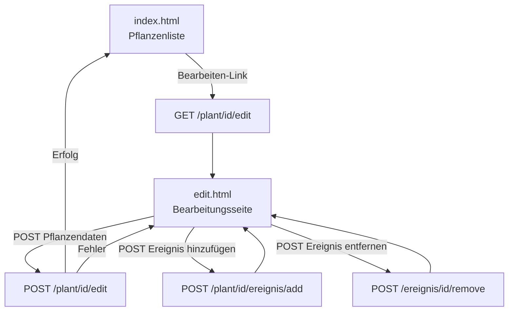

# Design: Pflanze bearbeiten & Mobiles Interface

## Overview

Diese Erweiterung fügt dem Garten-Tracker eine Bearbeitungsseite für einzelne Pflanzen hinzu und optimiert die Darstellung auf Mobilgeräten. Die Bearbeitungsseite (`/plant/<id>/edit`) dient als primäre mobile Schnittstelle: Sie zeigt alle Pflanzendaten, erlaubt deren Bearbeitung und verwaltet Ereignisse. Die Pflanzenliste auf der Hauptseite wird auf kleinen Bildschirmen auf die wesentlichen Spalten reduziert und als Kartenlayout dargestellt.

Die Implementierung folgt dem bestehenden Muster der App: serverseitiges Rendering mit Flask/Jinja2, SQLite-Datenbank, reines CSS für Responsivität.

## Architecture

Die Änderungen betreffen vier Schichten:

```
Browser
  │
  ├── GET  /plant/<id>/edit  ──► edit_route()  ──► get_plant(id)
  ├── POST /plant/<id>/edit  ──► edit_save()   ──► update_plant(id, ...)
  ├── POST /plant/<id>/ereignis/add  ──► add_ereignis_route()  [redirect → edit]
  └── POST /ereignis/<id>/remove     ──► remove_ereignis_route() [redirect → edit wenn next gesetzt]
```



Keine neuen externen Abhängigkeiten. Kein JavaScript.

## Components and Interfaces

### db.py — neue Funktionen

**`get_plant(plant_id: int) -> dict | None`**
- Liest eine einzelne Pflanze mit ihren Ereignissen aus der Datenbank.
- Gibt `None` zurück, wenn keine Pflanze mit der ID existiert.
- Rückgabeformat: `{"id": int, "name": str, "type": str, "variety": str|None, "lichtbedarf": str, "kommentar": str|None, "ereignisse": [...]}`

**`update_plant(plant_id: int, name: str, type: str, variety: str|None, lichtbedarf: str, kommentar: str|None) -> None`**
- Aktualisiert alle Felder einer Pflanze per `UPDATE`.
- Keine Rückgabe; wirft keine Exception bei nicht existierender ID (0 Zeilen betroffen).

### app.py — neue und geänderte Routen

**`GET /plant/<int:plant_id>/edit` → `edit_route(plant_id)`**
- Ruft `get_plant(plant_id)` auf; gibt 404 zurück wenn `None`.
- Rendert `edit.html` mit `plant`, `german_months`, `VALID_EREIGNISTYPEN`.

**`POST /plant/<int:plant_id>/edit` → `edit_save(plant_id)`**
- Validiert `name`, `type`, `lichtbedarf` (gleiche Regeln wie `/add`).
- Ruft `update_plant(...)` auf.
- Leitet bei Erfolg auf `url_for("index")` weiter.
- Gibt bei Fehler `edit.html` mit HTTP 400 und `error`-Variable zurück.

**`POST /plant/<int:plant_id>/ereignis/add` — geändert**
- Liest optionalen Hidden-Field `next` aus dem Formular.
- Leitet nach Erfolg auf `next` weiter, falls gesetzt und sicher; sonst auf `url_for("index")`.
- Gibt bei Fehler die Seite zurück, die dem `next`-Wert entspricht (edit.html oder index.html).

**`POST /ereignis/<int:ereignis_id>/remove` — geändert**
- Liest optionalen Hidden-Field `next` aus dem Formular.
- Leitet nach Erfolg auf `next` weiter, falls gesetzt; sonst auf `url_for("index")`.

### templates/edit.html

Erweitert `base.html`. Enthält:
- Formular mit `action="/plant/{{ plant.id }}/edit"` und `method="post"` für Pflanzendaten.
- Anzeige aller Ereignisse mit Entfernen-Schaltfläche (Hidden-Field `next=/plant/{{ plant.id }}/edit`).
- Formular zum Hinzufügen eines Ereignisses mit Hidden-Field `next=/plant/{{ plant.id }}/edit`.
- Link zurück zur Pflanzenliste.

### templates/base.html — Änderung

Viewport-Meta-Tag hinzufügen:
```html
<meta name="viewport" content="width=device-width, initial-scale=1">
```

### templates/index.html — Änderung

- „Bearbeiten"-Link pro Pflanze in der Aktionsspalte: `<a href="/plant/{{ plant.id }}/edit">Bearbeiten</a>`
- CSS-Klassen für mobile Spalten: `class="hide-mobile"` auf `<th>` und `<td>` für Sorte, Kommentar, Ereignisse, „Ereignis hinzufügen".

### static/style.css — Änderungen

Media Query `@media (max-width: 599px)`:
- `.hide-mobile { display: none; }` — blendet Spalten aus.
- Kartenlayout: `table`, `thead`, `tbody`, `tr`, `th`, `td` als Block-Elemente; jede `tr` als Karte mit Border und Padding.
- Interaktive Elemente: `min-height: 44px; min-width: 44px` für `button`, `a`, `select`, `input`.
- Formularfelder auf Bearbeitungsseite: `input, select, textarea { width: 100%; }`.

## Data Models

Keine Schemaänderungen. Die bestehende `plants`-Tabelle und `ereignisse`-Tabelle werden unverändert genutzt.

```
plants
  id          INTEGER PRIMARY KEY AUTOINCREMENT
  name        TEXT NOT NULL
  type        TEXT NOT NULL
  variety     TEXT (nullable)
  lichtbedarf TEXT
  kommentar   TEXT (nullable)

ereignisse
  id          INTEGER PRIMARY KEY AUTOINCREMENT
  plant_id    INTEGER NOT NULL REFERENCES plants(id) ON DELETE CASCADE
  ereignistyp TEXT NOT NULL
  startmonat  INTEGER NOT NULL
  endmonat    INTEGER NOT NULL
```

`get_plant(id)` liest beide Tabellen per JOIN-äquivalent (wie `get_all_plants`, aber gefiltert auf eine ID).

### `next`-Parameter-Sicherheit

Der `next`-Wert aus dem Hidden-Field wird nur als Redirect-Ziel verwendet, wenn er mit `/plant/` beginnt oder gleich `/` ist. Damit werden Open-Redirect-Angriffe verhindert.


## Correctness Properties

*A property is a characteristic or behavior that should hold true across all valid executions of a system — essentially, a formal statement about what the system should do. Properties serve as the bridge between human-readable specifications and machine-verifiable correctness guarantees.*

**Property Reflection:** After prework analysis, the following consolidations were made:
- Requirements 2.3 and 2.5 (events displayed, remove button per event) are combined into one property since both test the same rendering loop.
- Requirements 3.2 and 3.3 (empty name / empty type rejected) are combined since both test the same "required fields" validation rule.
- Requirements 4.3 and 4.4 (invalid month range / invalid event type) remain separate as they test distinct validation paths.
- CSS/responsive requirements (5.1–5.4, 6.1–6.3) are SMOKE tests and do not yield properties.

---

### Property 1: Bearbeiten-Link für jede Pflanze

*For any* list of plants rendered on the index page, each plant SHALL have an anchor element with `href="/plant/<id>/edit"` and the text „Bearbeiten".

**Validates: Requirements 1.1**

---

### Property 2: Bearbeitungsseite zeigt aktuelle Pflanzendaten

*For any* plant stored in the database, a GET request to `/plant/<id>/edit` SHALL return a page whose form fields contain exactly the stored values for name, type, variety, lichtbedarf, and kommentar.

**Validates: Requirements 2.1**

---

### Property 3: Bearbeitungsseite zeigt alle Ereignisse mit Entfernen-Schaltfläche

*For any* plant with any set of events, the edit page SHALL display every event (with correct type and German month names) and SHALL render exactly one remove button per event.

**Validates: Requirements 2.3, 2.5**

---

### Property 4: Speichern aktualisiert Pflanzendaten

*For any* valid combination of plant field values (name, type, variety, lichtbedarf, kommentar), a POST to `/plant/<id>/edit` SHALL update the database record to the submitted values and redirect to `/`.

**Validates: Requirements 3.1**

---

### Property 5: Leere Pflichtfelder werden abgelehnt

*For any* POST to `/plant/<id>/edit` where name or type is empty or whitespace-only, the validator SHALL return HTTP 400 with the error message „Name und Typ dürfen nicht leer sein." and the plant record SHALL remain unchanged.

**Validates: Requirements 3.2, 3.3**

---

### Property 6: Ungültiger Lichtbedarf wird abgelehnt

*For any* string not in `{"Sonne", "Halbschatten", "Schatten"}` submitted as lichtbedarf, the validator SHALL return HTTP 400 with the error message „Lichtbedarf muss Sonne, Halbschatten oder Schatten sein."

**Validates: Requirements 3.4**

---

### Property 7: Optionale Felder werden als NULL gespeichert

*For any* POST to `/plant/<id>/edit` where variety or kommentar is an empty string, the database SHALL store NULL for that field.

**Validates: Requirements 3.6**

---

### Property 8: Ereignis hinzufügen leitet auf Bearbeitungsseite weiter

*For any* valid event data submitted to `/plant/<id>/ereignis/add` with `next=/plant/<id>/edit`, the app SHALL save the event and redirect to `/plant/<id>/edit`.

**Validates: Requirements 4.1**

---

### Property 9: Ereignis entfernen leitet auf Bearbeitungsseite weiter

*For any* event removal request to `/ereignis/<id>/remove` with `next=/plant/<plant_id>/edit`, the app SHALL delete the event and redirect to `/plant/<plant_id>/edit`.

**Validates: Requirements 4.2**

---

### Property 10: Ungültiger Monatsbereich wird abgelehnt

*For any* pair (startmonat, endmonat) where startmonat > endmonat, a POST to `/plant/<id>/ereignis/add` SHALL return HTTP 400 with the error message „Startmonat darf nicht größer als Endmonat sein."

**Validates: Requirements 4.3**

---

### Property 11: Ungültiger Ereignistyp wird abgelehnt

*For any* string not in `{"Blüte", "Ernte", "Düngen", "Rückschnitt"}` submitted as ereignistyp, the validator SHALL return HTTP 400 with the error message „Ereignistyp ungültig."

**Validates: Requirements 4.4**

---

## Error Handling

| Situation | Verhalten |
|---|---|
| GET/POST `/plant/<id>/edit` mit unbekannter ID | `abort(404)` |
| Leeres `name` oder `type` | HTTP 400, Fehlermeldung, edit.html erneut rendern |
| Ungültiger `lichtbedarf` | HTTP 400, Fehlermeldung, edit.html erneut rendern |
| Ungültiger `ereignistyp` | HTTP 400, Fehlermeldung, edit.html erneut rendern |
| `startmonat > endmonat` | HTTP 400, Fehlermeldung, edit.html erneut rendern |
| Ungültiger `next`-Wert (Open Redirect) | Fallback auf `url_for("index")` |
| DB-Fehler | Unbehandelt (propagiert als 500, wie bisher) |

Fehlermeldungen werden über die `error`-Template-Variable übergeben, identisch zum bestehenden Muster in `index.html`.

## Testing Strategy

### Dual Testing Approach

Unit- und Property-Tests ergänzen sich:
- **Unit-Tests**: konkrete Beispiele, Fehlerfälle, Integrationspunkte
- **Property-Tests**: universelle Eigenschaften über viele generierte Eingaben

### Property-Based Testing

Die Feature enthält reine Logik (Validierung, Datenbankoperationen, Redirect-Entscheidungen), die gut für Property-Based Testing geeignet ist.

**Bibliothek**: [Hypothesis](https://hypothesis.readthedocs.io/) (Python)

**Konfiguration**: Jeder Property-Test läuft mit mindestens 100 Iterationen (`@settings(max_examples=100)`).

**Tag-Format**: Jeder Property-Test enthält einen Kommentar:
```
# Feature: pflanze-bearbeiten, Property <N>: <property_text>
```

**Property-Tests** (eine Testfunktion pro Property):

| Property | Testfunktion | Generatoren |
|---|---|---|
| P1: Bearbeiten-Link | `test_edit_link_rendered_for_all_plants` | `st.lists(plant_strategy, min_size=1)` |
| P2: Formular vorausgefüllt | `test_edit_form_prefilled` | `plant_strategy` |
| P3: Ereignisse + Entfernen-Button | `test_edit_page_shows_all_events` | `plant_strategy`, `st.lists(ereignis_strategy)` |
| P4: Speichern aktualisiert DB | `test_update_plant_persists` | `valid_plant_fields_strategy` |
| P5: Leere Pflichtfelder abgelehnt | `test_empty_required_fields_rejected` | `st.text(whitespace)` |
| P6: Ungültiger Lichtbedarf abgelehnt | `test_invalid_lichtbedarf_rejected` | `st.text().filter(not in VALID)` |
| P7: Optionale Felder als NULL | `test_optional_fields_stored_as_null` | `plant_strategy` |
| P8: Ereignis-Add leitet auf Edit | `test_add_ereignis_redirects_to_edit` | `ereignis_strategy` |
| P9: Ereignis-Remove leitet auf Edit | `test_remove_ereignis_redirects_to_edit` | `st.integers(min_value=1)` |
| P10: Ungültiger Monatsbereich | `test_invalid_month_range_rejected` | `st.integers(1,12)` pairs where start > end |
| P11: Ungültiger Ereignistyp | `test_invalid_ereignistyp_rejected` | `st.text().filter(not in VALID)` |

### Unit-Tests (Beispiele und Randfälle)

- GET `/plant/99999/edit` → 404
- POST `/plant/99999/edit` → 404
- GET `/plant/<id>/edit` gibt Add-Ereignis-Formular zurück (Anforderung 2.4)
- `next`-Wert mit externer URL → Fallback auf `/` (Open-Redirect-Schutz)
- Viewport-Meta-Tag in `base.html` vorhanden (Anforderung 5.4)
- CSS-Datei enthält `@media (max-width: 599px)` mit `.hide-mobile` (Anforderungen 5.1–5.2)

### Smoke-Tests

- CSS enthält Kartenlayout-Regeln im Media Query (Anforderung 5.3)
- CSS enthält `min-height: 44px` für interaktive Elemente (Anforderung 6.1)
- CSS enthält `width: 100%` für Formularfelder im Media Query (Anforderung 6.2)
