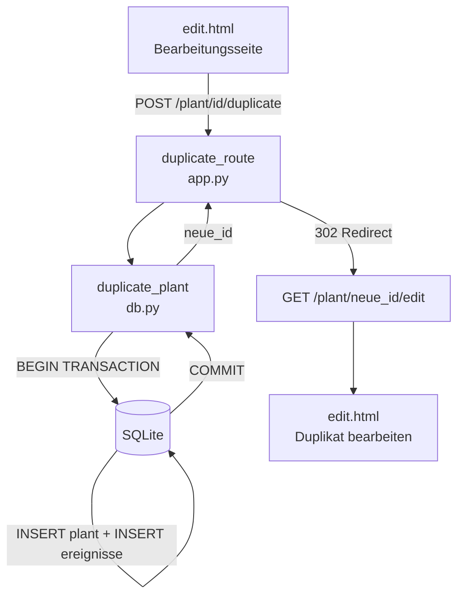

# Design-Dokument: Pflanze duplizieren

## Übersicht

Diese Funktion ermöglicht das Duplizieren einer bestehenden Pflanze inklusive aller Stammdaten und erwarteten Ereignisse. Der Hauptanwendungsfall ist die Mehrfachaussaat derselben Pflanze zu unterschiedlichen Zeitpunkten (z.B. Zuckererbsen im März und April). Anstatt die Pflanze komplett neu anzulegen, wird sie kopiert und der Benutzer passt anschließend die Ereigniszeiträume am Duplikat an.

**Designentscheidungen:**
- Keine Fremdschlüssel-Beziehung zwischen Original und Duplikat — das Duplikat ist nach der Erstellung eine vollständig eigenständige Pflanze.
- Automatische Namensanpassung mit Satz-Suffix: „Zuckererbsen" → „Zuckererbsen (2. Satz)", „Zuckererbsen (2. Satz)" → „Zuckererbsen (3. Satz)".
- Beobachtungen werden bewusst nicht kopiert, da sie spezifisch für eine einzelne Pflanzung sind.
- Atomare Transaktion: Pflanze und Ereignisse werden in einer einzigen Transaktion kopiert — bei Fehler wird nichts geschrieben.
- Der Duplizieren-Button befindet sich auf der Bearbeitungsseite (`edit.html`), nicht in der Pflanzenliste.
- PRG-Pattern: POST zum Duplizieren, Redirect auf die Bearbeitungsseite des Duplikats.

## Architektur



```
Browser
  │
  └── POST /plant/<id>/duplicate  ──► duplicate_route()
        ├── get_plant(id)           → 404 wenn None
        ├── duplicate_plant(id)     → neue_id (atomare Transaktion)
        └── redirect → /plant/<neue_id>/edit
```

Keine neuen Abhängigkeiten. Kein JavaScript erforderlich.

## Komponenten und Schnittstellen

### db.py — neue Funktionen

**`generate_satz_name(name: str) -> str`**
- Reine Funktion (kein DB-Zugriff).
- Prüft per Regex, ob `name` bereits ein Satz-Suffix `(N. Satz)` enthält.
- Ohne Suffix: gibt `"{name} (2. Satz)"` zurück.
- Mit Suffix `(N. Satz)`: gibt `"{Basisname} ({N+1}. Satz)"` zurück.
- Regex-Pattern: `r'^(.*?)\s*\((\d+)\.\s*Satz\)$'`

**`duplicate_plant(plant_id: int) -> int`**
- Liest die Quellpflanze und ihre Ereignisse in einer Transaktion.
- Erzeugt den neuen Namen via `generate_satz_name()`.
- Fügt eine neue Pflanze mit allen Stammdaten (außer ID) ein.
- Kopiert alle Ereignisse der Quellpflanze mit der neuen Pflanzen-ID.
- Kopiert keine Beobachtungen.
- Gibt die neue Pflanzen-ID zurück.
- Bei Fehler: Rollback der gesamten Transaktion, Exception wird propagiert.

### app.py — neue Route

**`POST /plant/<int:plant_id>/duplicate` → `duplicate_route(plant_id)`**
- Ruft `get_plant(plant_id)` auf; gibt 404 zurück wenn `None`.
- Ruft `duplicate_plant(plant_id)` auf.
- Leitet bei Erfolg auf `/plant/<neue_id>/edit` weiter (HTTP 302).
- Bei Datenbankfehler: HTTP 500 (Flask-Standard).

### templates/edit.html — Änderung

- Neuer „Duplizieren"-Button als POST-Formular im Aktionsbereich der Bearbeitungsseite.
- Platzierung: im Bereich „Pflanze entfernen" als zusätzliche Aktion, oder als eigener Abschnitt oberhalb des Löschbereichs.

```html
<form method="post" action="/plant/{{ plant.id }}/duplicate" style="display:inline">
    <button type="submit" class="btn btn-outline btn-sm">📋 Duplizieren</button>
</form>
```

### app.py — Import-Änderung

`duplicate_plant` wird aus `db.py` importiert:
```python
from db import (..., duplicate_plant)
```

## Datenmodelle

Keine Schemaänderungen. Die bestehenden Tabellen `plants`, `ereignisse` und `beobachtungen` werden unverändert genutzt.

```
plants
  id            INTEGER PRIMARY KEY AUTOINCREMENT
  name          TEXT NOT NULL
  type          TEXT NOT NULL
  variety       TEXT
  lichtbedarf   TEXT
  kommentar     TEXT
  lebensdauer   TEXT
  pflanzmonat   INTEGER
  pflanzjahr    INTEGER
  anzahl        INTEGER DEFAULT 1
  kategorie     TEXT
  beschreibung  TEXT
  farbe         TEXT

ereignisse
  id            INTEGER PRIMARY KEY AUTOINCREMENT
  plant_id      INTEGER NOT NULL REFERENCES plants(id) ON DELETE CASCADE
  ereignistyp   TEXT NOT NULL
  startmonat    INTEGER NOT NULL
  endmonat      INTEGER NOT NULL
  start_detail  TEXT
  end_detail    TEXT

beobachtungen
  id                    INTEGER PRIMARY KEY AUTOINCREMENT
  plant_id              INTEGER NOT NULL REFERENCES plants(id) ON DELETE CASCADE
  jahr                  INTEGER NOT NULL
  ereignistyp           TEXT NOT NULL
  startmonat            INTEGER NOT NULL
  endmonat              INTEGER NOT NULL
  phaenologische_phase  TEXT
  notiz                 TEXT
  start_detail          TEXT
  end_detail            TEXT
```

### Duplikations-Datenfluss

```
Quellpflanze (ID=5)                    Duplikat (ID=42)
├── name: "Zuckererbsen"         →     ├── name: "Zuckererbsen (2. Satz)"
├── kategorie: "Gemüse"         →     ├── kategorie: "Gemüse"
├── ... (alle Stammdaten)        →     ├── ... (identisch kopiert)
├── ereignisse:                        ├── ereignisse:
│   ├── {Vorkultur, 3, 3}       →     │   ├── {Vorkultur, 3, 3}  (neue ID)
│   └── {Ernte, 6, 8}           →     │   └── {Ernte, 6, 8}      (neue ID)
└── beobachtungen:                     └── beobachtungen: []  (leer)
    ├── {2024, Ernte, 7, 8}      ✗         (nicht kopiert)
    └── {2024, Vorkultur, 3, 3}  ✗
```


## Correctness Properties

*A property is a characteristic or behavior that should hold true across all valid executions of a system — essentially, a formal statement about what the system should do. Properties serve as the bridge between human-readable specifications and machine-verifiable correctness guarantees.*

**Property Reflection:** Nach der Prework-Analyse wurden folgende Konsolidierungen vorgenommen:
- Anforderungen 2.1 und 2.2 (Stammdaten kopieren + neue ID) werden zu einer Property kombiniert, da beide denselben Duplikationsvorgang testen.
- Anforderungen 3.1 und 3.2 (Satz-Suffix ohne/mit bestehendem Suffix) werden kombiniert, da `generate_satz_name` eine reine Funktion ist, die beide Fälle abdeckt.
- Anforderungen 4.1 und 4.2 (Ereignisse kopieren + neue Ereignis-IDs) werden kombiniert.
- Anforderungen 5.1 und 5.2 sind redundant (keine Beobachtungen kopiert = leere Beobachtungsliste) — nur eine Property.
- Anforderungen 6.1 und 6.2 (keine FK-Beziehung + gegenseitige Unabhängigkeit) werden zu einer Unabhängigkeits-Property kombiniert.
- Anforderung 1.2 (POST-Methode) ist ein statisches HTML-Attribut — als EXAMPLE-Test, keine Property.
- Anforderung 8.1 (404 bei nicht existierender Pflanze) ist ein Edge-Case — als EXAMPLE-Test.
- Anforderung 8.2 (atomare Transaktion) ist ein Integrations-Test.

---

### Property 1: Duplizieren-Button auf Bearbeitungsseite

*For any* Pflanze in der Datenbank, die Bearbeitungsseite (`GET /plant/<id>/edit`) SHALL ein Formular mit `action="/plant/<id>/duplicate"` und `method="post"` enthalten.

**Validates: Requirements 1.1**

---

### Property 2: Satz-Suffix-Generierung

*For any* Pflanzennamen, `generate_satz_name` SHALL folgende Transformation durchführen: Wenn der Name kein Satz-Suffix `(N. Satz)` enthält, wird `" (2. Satz)"` angehängt. Wenn der Name bereits ein Suffix `(N. Satz)` enthält, wird N um 1 erhöht. In beiden Fällen ist die Transformation deterministisch und der Basisname bleibt unverändert.

**Validates: Requirements 3.1, 3.2**

---

### Property 3: Stammdaten-Kopie mit neuer ID

*For any* Pflanze mit beliebigen Stammdaten (Name, Kategorie, Typ, Sorte, Lichtbedarf, Lebensdauer, Farbe, Anzahl, Pflanzmonat, Pflanzjahr, Beschreibung, Kommentar), nach der Duplizierung SHALL das Duplikat eine neue, unterschiedliche ID besitzen und alle Stammdaten außer dem Namen identisch zum Original haben.

**Validates: Requirements 2.1, 2.2**

---

### Property 4: Ereignisse kopiert mit neuen IDs

*For any* Pflanze mit beliebig vielen Ereignissen, nach der Duplizierung SHALL das Duplikat exakt dieselbe Anzahl Ereignisse besitzen, wobei jedes kopierte Ereignis identische Werte für Ereignistyp, Startmonat, Endmonat, Start-Detail und End-Detail hat, aber eine neue, eigenständige Ereignis-ID.

**Validates: Requirements 4.1, 4.2**

---

### Property 5: Keine Beobachtungen im Duplikat

*For any* Pflanze mit beliebig vielen Beobachtungen, nach der Duplizierung SHALL das Duplikat eine leere Beobachtungsliste besitzen — keine Beobachtung der Quellpflanze wird übertragen.

**Validates: Requirements 5.1, 5.2**

---

### Property 6: Unabhängigkeit von Original und Duplikat

*For any* duplizierte Pflanze, das Löschen der Quellpflanze SHALL das Duplikat und seine Ereignisse nicht beeinflussen. Ebenso SHALL das Ändern von Stammdaten der Quellpflanze keine Auswirkung auf das Duplikat haben.

**Validates: Requirements 6.1, 6.2**

---

### Property 7: Weiterleitung zur Duplikat-Bearbeitungsseite

*For any* existierende Pflanze, ein POST auf `/plant/<id>/duplicate` SHALL einen HTTP-302-Redirect auf `/plant/<neue_id>/edit` zurückgeben, wobei `<neue_id>` die ID des neu erstellten Duplikats ist.

**Validates: Requirements 7.1**

---

## Fehlerbehandlung

| Fehlerfall | Verhalten |
|---|---|
| POST `/plant/<id>/duplicate` mit nicht existierender ID | `abort(404)` |
| Datenbankfehler während der Duplizierung | Rollback der gesamten Transaktion, keine teilweise kopierten Daten, HTTP 500 |
| Ungültige `plant_id` (nicht-numerisch) | Flask-Standard-404 (URL-Matching schlägt fehl) |

Die atomare Transaktion wird durch explizites `BEGIN`/`COMMIT` in `duplicate_plant()` sichergestellt. Bei einer Exception wird automatisch ein Rollback durchgeführt (SQLite-Standardverhalten bei `with conn:`).

## Testing-Strategie

### Ansatz

Die Kernlogik besteht aus einer reinen Funktion (`generate_satz_name`) und einer Datenbank-Transaktion (`duplicate_plant`) — beides gut geeignet für Property-Based Testing. Die Namens-Generierung ist eine reine Funktion mit großem Eingaberaum (beliebige Strings). Die Duplikationslogik hat klare Invarianten (alle Felder kopiert, keine Beobachtungen, neue IDs).

**PBT-Bibliothek:** [Hypothesis](https://hypothesis.readthedocs.io/) (Python, bereits im Projekt vorhanden)

### Property-Based Tests (Hypothesis, min. 100 Iterationen je Property)

| Test | Property | Beschreibung |
|------|----------|--------------|
| `test_duplicate_button_rendered` | Property 1 | Zufällige Pflanze → Bearbeitungsseite enthält Duplizieren-Formular |
| `test_satz_suffix_generation` | Property 2 | Zufällige Namen → korrekte Suffix-Transformation |
| `test_stammdaten_copied` | Property 3 | Zufällige Stammdaten → Duplikat hat identische Felder (außer ID/Name) |
| `test_ereignisse_copied` | Property 4 | Zufällige Ereignisse → Duplikat hat identische Ereignisse mit neuen IDs |
| `test_no_beobachtungen_copied` | Property 5 | Pflanze mit Beobachtungen → Duplikat hat leere Beobachtungsliste |
| `test_original_duplicate_independent` | Property 6 | Original löschen/ändern → Duplikat unverändert |
| `test_redirect_to_duplicate_edit` | Property 7 | POST duplicate → 302 Redirect auf `/plant/<neue_id>/edit` |

Tag-Format: `# Feature: pflanze-duplizieren, Property {N}: {property_text}`

### Example-Based Tests (pytest)

| Test | Anforderung | Beschreibung |
|------|-------------|--------------|
| `test_duplicate_nonexistent_plant_404` | 8.1 | POST `/plant/99999/duplicate` → HTTP 404 |
| `test_duplicate_form_method_is_post` | 1.2 | Duplizieren-Formular hat `method="post"` |
| `test_satz_suffix_concrete_examples` | 3.1, 3.2 | „Zuckererbsen" → „Zuckererbsen (2. Satz)", „Tomate (2. Satz)" → „Tomate (3. Satz)" |

### Integrations-Tests

| Test | Anforderung | Beschreibung |
|------|-------------|--------------|
| `test_atomic_transaction_on_failure` | 8.2 | Simulierter DB-Fehler → keine teilweise kopierten Daten |
