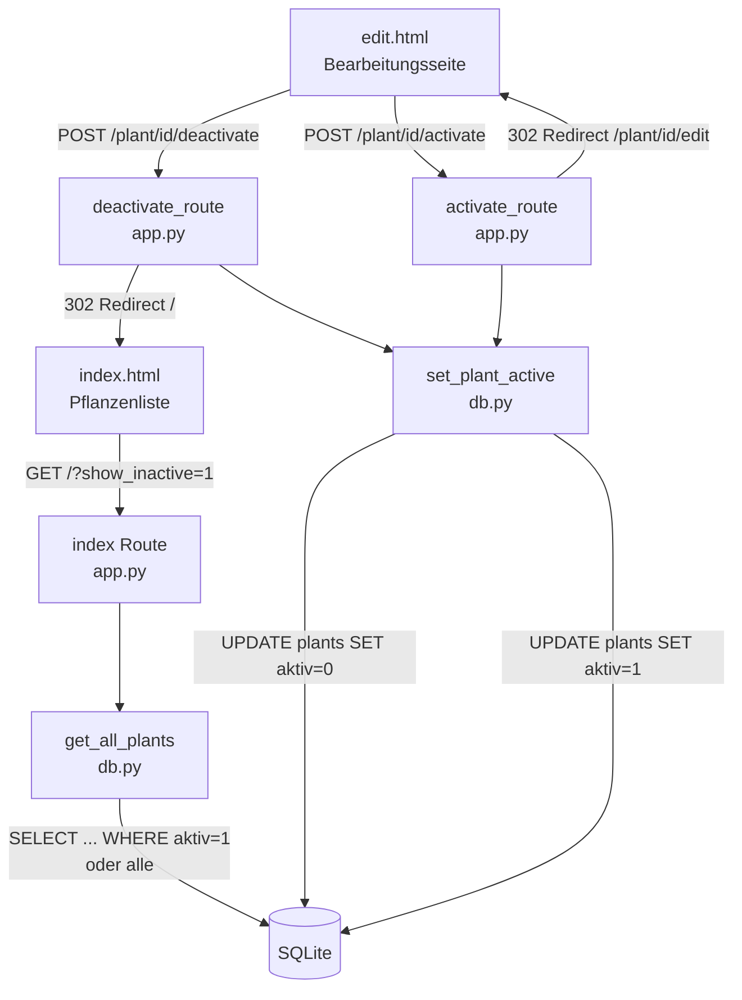

# Design-Dokument: Pflanze inaktiv setzen

## Übersicht

Diese Funktion erweitert den Garten-Tracker um die Möglichkeit, Pflanzen als „inaktiv" zu markieren, anstatt sie zu löschen. Inaktive Pflanzen behalten alle Stammdaten, Ereignisse und Beobachtungen, werden aber standardmäßig aus der Pflanzenliste ausgeblendet. Über einen Filter-Schalter können sie eingeblendet und jederzeit wieder aktiviert werden.

**Designentscheidungen:**
- Neues INTEGER-Feld `aktiv` in der `plants`-Tabelle (0 = inaktiv, 1 = aktiv), Standardwert 1.
- Migration via `_migrate()` mit `PRAGMA table_info`-Check — bestehende Pflanzen erhalten automatisch `aktiv = 1`.
- Zwei neue POST-Routen: `/plant/<id>/deactivate` und `/plant/<id>/activate` (PRG-Pattern).
- Filterung in `get_all_plants()` über optionalen Parameter `include_inactive` — standardmäßig werden nur aktive Pflanzen zurückgegeben.
- Inaktive Pflanzen in der Liste visuell abgesetzt: reduzierte Deckkraft (CSS `opacity: 0.5`) und ein Badge „inaktiv".
- Auf der Bearbeitungsseite: Hinweisbanner für inaktive Pflanzen, kontextabhängiger Button (Inaktiv setzen / Aktivieren).
- Beim Duplizieren einer inaktiven Pflanze wird das Duplikat immer als aktiv erstellt.
- Alle bestehenden Funktionen (Bearbeiten, Ereignisse, Beobachtungen, Löschen) bleiben für inaktive Pflanzen uneingeschränkt verfügbar.

## Architektur



```
Browser
  │
  ├── GET /                          → index() filtert nach aktiv-Status
  ├── POST /plant/<id>/deactivate   → deactivate_route()
  │     ├── get_plant(id)            → 404 wenn None
  │     ├── set_plant_active(id, 0)  → UPDATE
  │     └── redirect → /
  └── POST /plant/<id>/activate     → activate_route()
        ├── get_plant(id)            → 404 wenn None
        ├── set_plant_active(id, 1)  → UPDATE
        └── redirect → /plant/<id>/edit
```

Keine neuen Abhängigkeiten. Minimales Inline-JS für den Filter-Schalter (`onchange`).

## Komponenten und Schnittstellen

### db.py — Änderungen

**Migration in `_migrate()`:**
- Prüft via `PRAGMA table_info(plants)`, ob Spalte `aktiv` existiert.
- Falls nicht: `ALTER TABLE plants ADD COLUMN aktiv INTEGER DEFAULT 1`.
- Alle bestehenden Pflanzen erhalten dadurch automatisch `aktiv = 1`.

**`set_plant_active(plant_id: int, aktiv: int) -> None`** (neue Funktion)
- Setzt `aktiv` auf den übergebenen Wert (0 oder 1).
- `UPDATE plants SET aktiv = ? WHERE id = ?`
- Öffnet/schließt eigene Verbindung via `get_db()`.

**`get_all_plants(include_inactive: bool = False) -> list[dict]`** (geändert)
- Neuer optionaler Parameter `include_inactive`.
- `include_inactive=False` (Standard): `WHERE aktiv = 1`.
- `include_inactive=True`: kein WHERE-Filter auf `aktiv`.
- Das Feld `aktiv` wird in die SELECT-Spalten aufgenommen.

**`get_plant(plant_id: int) -> dict | None`** (geändert)
- Nimmt `aktiv` in die SELECT-Spalten auf.
- Kein Filter auf `aktiv` — inaktive Pflanzen bleiben über Direktlink erreichbar.

**`add_plant(...)` (unverändert)**
- Kein expliziter `aktiv`-Parameter nötig — der `DEFAULT 1` in der Spalte greift.

**`duplicate_plant(plant_id: int) -> int`** (geändert)
- Das Duplikat wird immer mit `aktiv = 1` erstellt, unabhängig vom Status der Quellpflanze.
- Die INSERT-Anweisung setzt `aktiv = 1` explizit.

### app.py — Änderungen

**Import-Änderung:**
```python
from db import (..., set_plant_active)
```

**`POST /plant/<int:plant_id>/deactivate` → `deactivate_route(plant_id)`** (neue Route)
- Ruft `get_plant(plant_id)` auf; gibt 404 zurück wenn `None`.
- Ruft `set_plant_active(plant_id, 0)` auf.
- Leitet bei Erfolg auf `/` weiter (HTTP 302).

**`POST /plant/<int:plant_id>/activate` → `activate_route(plant_id)`** (neue Route)
- Ruft `get_plant(plant_id)` auf; gibt 404 zurück wenn `None`.
- Ruft `set_plant_active(plant_id, 1)` auf.
- Leitet bei Erfolg auf `/plant/<id>/edit` weiter (HTTP 302).

**`GET /` → `index()`** (geändert)
- Liest Query-Parameter `show_inactive` aus (`request.args.get("show_inactive", "")`).
- Ruft `get_all_plants(include_inactive=bool(show_inactive))` auf.
- Übergibt `show_inactive`-Flag an das Template.

**`_safe_next()`** — keine Änderung nötig.

### templates/index.html — Änderungen

**Filter-Schalter:**
- Neues Checkbox-Element im Filter-Bereich: „Inaktive anzeigen".
- Bei Aktivierung wird `show_inactive=1` als Query-Parameter übergeben.
- Implementierung via `onchange="this.form.submit()"`.

**Visuelle Kennzeichnung inaktiver Pflanzen:**
- Tabellenzeilen inaktiver Pflanzen erhalten die CSS-Klasse `row-inactive`.
- Ein Badge `<span class="badge badge-inactive">inaktiv</span>` wird neben dem Pflanzennamen angezeigt.

### templates/edit.html — Änderungen

**Hinweisbanner für inaktive Pflanzen:**
```html

<div class="alert-inactive">
    💤 Diese Pflanze ist inaktiv.
</div>

```

**Kontextabhängiger Button:**
- Aktive Pflanze: Button „Inaktiv setzen" (POST auf `/plant/<id>/deactivate`).
- Inaktive Pflanze: Button „Aktivieren" (POST auf `/plant/<id>/activate`).
- Platzierung: eigener Abschnitt zwischen „Duplizieren" und „Pflanze entfernen".

### static/style.css — Änderungen

```css
/* Inaktive Pflanzen in der Tabelle */
.row-inactive { opacity: 0.5; }
.row-inactive:hover { opacity: 0.7; }

/* Badge für inaktive Pflanzen */
.badge-inactive {
  background: #e2e3e5;
  color: #6c757d;
}

/* Hinweisbanner auf der Bearbeitungsseite */
.alert-inactive {
  background: #fff3cd;
  color: #856404;
  border: 1px solid #ffc107;
  border-radius: var(--radius-sm);
  padding: .65rem 1rem;
  margin-bottom: 1rem;
  font-size: .9rem;
}
```

## Datenmodelle

### Schema-Änderung

Neue Spalte in der `plants`-Tabelle:

```sql
ALTER TABLE plants ADD COLUMN aktiv INTEGER DEFAULT 1
```

### Vollständiges Schema (nach Migration)

```
plants
  id            INTEGER PRIMARY KEY AUTOINCREMENT
  name          TEXT NOT NULL
  type          TEXT NOT NULL
  variety       TEXT
  lichtbedarf   TEXT
  kommentar     TEXT
  lebensdauer   TEXT
  pflanzmonat   INTEGER
  pflanzjahr    INTEGER
  anzahl        INTEGER DEFAULT 1
  kategorie     TEXT
  beschreibung  TEXT
  farbe         TEXT
  aktiv         INTEGER DEFAULT 1          ← NEU

ereignisse      (unverändert)
beobachtungen   (unverändert)
phaenologie     (unverändert)
```

### Werte für `aktiv`

| Wert | Bedeutung |
|------|-----------|
| 1    | Pflanze ist aktiv (Standard) |
| 0    | Pflanze ist inaktiv |


## Correctness Properties

*A property is a characteristic or behavior that should hold true across all valid executions of a system — essentially, a formal statement about what the system should do. Properties serve as the bridge between human-readable specifications and machine-verifiable correctness guarantees.*

**Property Reflection:** Nach der Prework-Analyse wurden folgende Konsolidierungen vorgenommen:
- 2.2 (Deaktivieren setzt aktiv=0) und 3.2 (Aktivieren setzt aktiv=1) werden zu einer Round-Trip-Property kombiniert: Deaktivieren → Aktivieren stellt den Originalzustand wieder her.
- 2.1 (Button „Inaktiv setzen" für aktive Pflanzen), 3.1 und 5.2 (Button „Aktivieren" für inaktive Pflanzen) werden zu einer Property kombiniert: Der angezeigte Button entspricht dem Aktiv-Status.
- 2.4 (Redirect nach Deactivate auf /) und 3.3 (Redirect nach Activate auf /plant/<id>/edit) werden zu einer Property über korrektes Redirect-Verhalten kombiniert.
- 4.1 (Standard nur aktive) und 4.3 (show_inactive zeigt alle) werden zu einer Filterverhalten-Property kombiniert.
- 5.2 ist redundant mit der Button-Property (2.1 + 3.1) — entfällt als eigenständige Property.
- 6.1, 6.2 und 6.3 (Bearbeitungsseite funktioniert für inaktive Pflanzen) werden zu einer Property kombiniert.
- 4.4 (visuelle Kennzeichnung) und 5.1 (Hinweisbanner) werden zu einer Property über visuelle Kennzeichnung kombiniert.

---

### Property 1: Neue Pflanzen sind standardmäßig aktiv

*For any* Pflanze mit beliebigen gültigen Stammdaten, nach dem Hinzufügen über `add_plant()` SHALL der Aktiv-Status der neuen Pflanze 1 (aktiv) sein.

**Validates: Requirements 1.3**

---

### Property 2: Deaktivieren-Aktivieren Round-Trip

*For any* aktive Pflanze, nach dem Deaktivieren (aktiv → 0) und anschließendem Aktivieren (aktiv → 1) SHALL der Aktiv-Status wieder 1 sein. Ebenso SHALL für jede inaktive Pflanze nach dem Aktivieren der Status 1 sein, und für jede aktive Pflanze nach dem Deaktivieren der Status 0.

**Validates: Requirements 2.2, 3.2**

---

### Property 3: Deaktivierung bewahrt alle Daten (Invariante)

*For any* Pflanze mit beliebigen Stammdaten, Ereignissen und Beobachtungen, nach dem Deaktivieren SHALL alle Stammdaten (Name, Kategorie, Typ, Sorte, Lichtbedarf, Lebensdauer, Farbe, Anzahl, Pflanzmonat, Pflanzjahr, Beschreibung, Kommentar), alle Ereignisse und alle Beobachtungen identisch zum Zustand vor der Deaktivierung sein — nur das Feld `aktiv` ändert sich.

**Validates: Requirements 2.3**

---

### Property 4: Kontextabhängiger Button auf der Bearbeitungsseite

*For any* Pflanze, die Bearbeitungsseite (`GET /plant/<id>/edit`) SHALL genau einen der beiden Buttons anzeigen: „Inaktiv setzen" wenn `aktiv = 1`, oder „Aktivieren" wenn `aktiv = 0`. Der jeweils andere Button SHALL nicht vorhanden sein.

**Validates: Requirements 2.1, 3.1, 5.2**

---

### Property 5: Korrektes Redirect-Verhalten nach Statusänderung

*For any* existierende Pflanze, ein POST auf `/plant/<id>/deactivate` SHALL einen HTTP-302-Redirect auf `/` zurückgeben. Ein POST auf `/plant/<id>/activate` SHALL einen HTTP-302-Redirect auf `/plant/<id>/edit` zurückgeben.

**Validates: Requirements 2.4, 3.3**

---

### Property 6: Filterverhalten der Pflanzenliste

*For any* Mischung aus aktiven und inaktiven Pflanzen in der Datenbank, die Pflanzenliste (`GET /`) SHALL nur aktive Pflanzen anzeigen. Mit dem Parameter `show_inactive=1` (`GET /?show_inactive=1`) SHALL die Liste alle Pflanzen (aktiv und inaktiv) anzeigen.

**Validates: Requirements 4.1, 4.3**

---

### Property 7: Visuelle Kennzeichnung inaktiver Pflanzen

*For any* inaktive Pflanze, wenn sie in der Pflanzenliste angezeigt wird (via `show_inactive=1`), SHALL ihre Tabellenzeile die CSS-Klasse `row-inactive` und ein Badge „inaktiv" enthalten. Auf der Bearbeitungsseite SHALL der Hinweis „Diese Pflanze ist inaktiv" angezeigt werden.

**Validates: Requirements 4.4, 5.1**

---

### Property 8: Bearbeitungsseite funktioniert für inaktive Pflanzen

*For any* inaktive Pflanze mit Ereignissen und Beobachtungen, die Bearbeitungsseite SHALL alle Stammdaten-Formularfelder, alle Ereignisse, alle Beobachtungen, das Ereignis-Hinzufügen-Formular, das Beobachtung-Hinzufügen-Formular und den Lösch-Button anzeigen — identisch zur Darstellung einer aktiven Pflanze (abgesehen vom Inaktiv-Hinweis und dem Aktivieren-Button).

**Validates: Requirements 6.1, 6.2, 6.3**

---

### Property 9: Duplikat einer inaktiven Pflanze ist aktiv

*For any* inaktive Pflanze, nach dem Duplizieren über `duplicate_plant()` SHALL das Duplikat den Aktiv-Status 1 (aktiv) besitzen.

**Validates: Requirements 7.1**

---

## Fehlerbehandlung

| Fehlerfall | Verhalten |
|---|---|
| POST `/plant/<id>/deactivate` mit nicht existierender ID | `abort(404)` — HTTP 404 |
| POST `/plant/<id>/activate` mit nicht existierender ID | `abort(404)` — HTTP 404 |
| Ungültige `plant_id` (nicht-numerisch) | Flask-Standard-404 (URL-Matching schlägt fehl) |
| Datenbankfehler bei `set_plant_active()` | try/except um den DB-Aufruf, Redirect auf `/` ohne Statusänderung |

Die Fehlerbehandlung für DB-Fehler wird in den Routen `deactivate_route` und `activate_route` implementiert:

```python
try:
    set_plant_active(plant_id, 0)
except Exception:
    return redirect(url_for("index"))
```

## Testing-Strategie

### Ansatz

Die Kernlogik besteht aus einer einfachen DB-Funktion (`set_plant_active`) und Filterlogik in `get_all_plants`. Die meisten Properties testen das Zusammenspiel von Route, DB-Funktion und Template-Rendering. Property-Based Testing ist geeignet, da das Verhalten über beliebige Pflanzendaten konsistent sein muss.

**PBT-Bibliothek:** [Hypothesis](https://hypothesis.readthedocs.io/) (Python, bereits im Projekt vorhanden)

### Property-Based Tests (Hypothesis, min. 100 Iterationen je Property)

| Test | Property | Beschreibung |
|------|----------|--------------|
| `test_new_plants_are_active` | Property 1 | Zufällige Pflanzendaten → aktiv=1 nach Einfügen |
| `test_deactivate_activate_roundtrip` | Property 2 | Zufällige Pflanze → deactivate/activate Round-Trip |
| `test_deactivation_preserves_data` | Property 3 | Zufällige Pflanze mit Ereignissen → alle Daten außer aktiv unverändert |
| `test_context_dependent_button` | Property 4 | Zufällige Pflanze → korrekter Button je nach Status |
| `test_redirect_after_status_change` | Property 5 | Zufällige Pflanze → korrekter Redirect nach deactivate/activate |
| `test_filter_active_inactive` | Property 6 | Zufällige Mischung → Standardansicht nur aktive, show_inactive alle |
| `test_visual_marking_inactive` | Property 7 | Inaktive Pflanze → row-inactive Klasse und Badge in Liste, Hinweis auf Edit-Seite |
| `test_edit_page_works_for_inactive` | Property 8 | Inaktive Pflanze mit Daten → alle Formulare und Daten vorhanden |
| `test_duplicate_inactive_is_active` | Property 9 | Inaktive Pflanze → Duplikat hat aktiv=1 |

Tag-Format: `# Feature: pflanze-inaktiv, Property {N}: {property_text}`

### Example-Based Tests (pytest)

| Test | Anforderung | Beschreibung |
|------|-------------|--------------|
| `test_deactivate_nonexistent_404` | 8.1 | POST `/plant/99999/deactivate` → HTTP 404 |
| `test_activate_nonexistent_404` | 8.1 | POST `/plant/99999/activate` → HTTP 404 |
| `test_filter_checkbox_present` | 4.2 | GET `/` enthält Checkbox „Inaktive anzeigen" |

### Integrations-Tests

| Test | Anforderung | Beschreibung |
|------|-------------|--------------|
| `test_migration_adds_aktiv_column` | 1.4 | DB ohne aktiv-Spalte → nach Migration haben alle Pflanzen aktiv=1 |
| `test_db_error_redirects_to_index` | 8.2 | Simulierter DB-Fehler → Redirect auf `/` |
