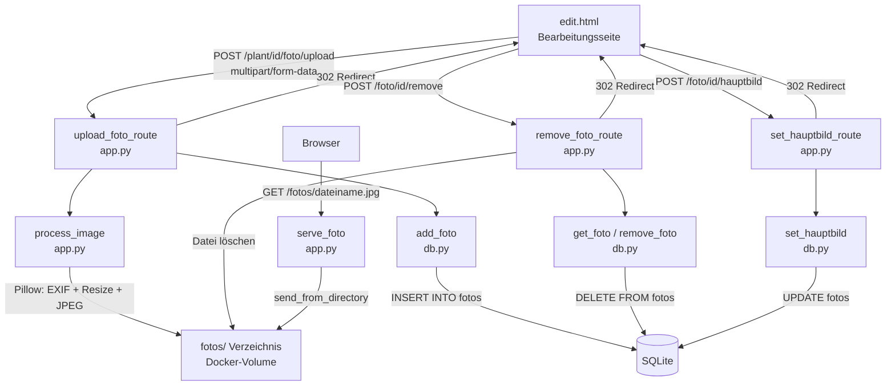

# Design-Dokument: Pflanzen-Fotos

## Übersicht

Diese Funktion erweitert den Garten-Tracker um die Möglichkeit, pro Pflanze bis zu 5 Fotos hochzuladen, anzuzeigen, zu löschen und ein Hauptbild festzulegen. Die Fotos werden serverseitig mit Pillow verkleinert (max. 640px lange Seite), EXIF-rotiert und als JPEG gespeichert. Die Bilddateien liegen im Docker-Volume neben der SQLite-Datenbank im Verzeichnis `fotos/`, die Metadaten in einer neuen Tabelle `fotos`.

**Designentscheidungen:**

- Neue SQLite-Tabelle `fotos` mit Fremdschlüssel auf `plants.id` (ON DELETE CASCADE) und Spalte `ist_hauptbild`.
- Fotodateien werden im Verzeichnis `{DB_PATH}/../fotos/` gespeichert — also neben der Datenbank im Docker-Volume `/data/fotos/`.
- Dateinamen: UUID4 + `.jpg` für Eindeutigkeit ohne Kollisionsrisiko.
- Bildverarbeitung: Pillow `ImageOps.exif_transpose()` für EXIF-Rotation, `Image.thumbnail()` für proportionale Verkleinerung, Speicherung als JPEG Qualität 85.
- Maximale Dateigröße vor Verarbeitung: 10 MB (Flask `MAX_CONTENT_LENGTH`).
- Maximale Fotoanzahl pro Pflanze: 5 (Prüfung in der Route vor dem Speichern).
- Erstes Foto einer Pflanze wird automatisch als Hauptbild gesetzt.
- Hauptbild-Wechsel: atomares UPDATE (alle `ist_hauptbild=0` für die Pflanze, dann das gewählte auf 1).
- Beim Löschen des Hauptbilds wird kein anderes Foto automatisch zum Hauptbild — der Benutzer wählt manuell.
- Beim Löschen einer Pflanze greift ON DELETE CASCADE für die DB-Zeilen; die Fotodateien werden explizit in `remove_plant()` gelöscht.
- Fotos werden über eine Flask-Route `/fotos/<dateiname>` ausgeliefert (via `send_from_directory`).
- Neue Abhängigkeit: `Pillow` in `requirements.txt`.
- Migration: Schema-Version 3 in `_migrate()`.

## Architektur



```
Browser
  │
  ├── GET /plant/<id>/edit           → edit_route() — lädt Fotos mit
  ├── POST /plant/<id>/foto/upload   → upload_foto_route()
  │     ├── Validierung (MIME, Größe, Anzahl)
  │     ├── process_image() — EXIF + Resize + JPEG
  │     ├── Datei speichern → fotos/
  │     ├── add_foto() → INSERT INTO fotos
  │     └── redirect → /plant/<id>/edit
  ├── POST /foto/<id>/remove         → remove_foto_route()
  │     ├── get_foto() → Metadaten laden
  │     ├── remove_foto() → DELETE FROM fotos
  │     ├── Datei löschen → fotos/
  │     └── redirect → /plant/<plant_id>/edit
  ├── POST /foto/<id>/hauptbild      → set_hauptbild_route()
  │     ├── set_hauptbild() → UPDATE fotos
  │     └── redirect → /plant/<plant_id>/edit
  └── GET /fotos/<dateiname>         → serve_foto()
        └── send_from_directory(FOTOS_DIR)
```

Neue Abhängigkeit: `Pillow`. Keine JavaScript-Frameworks — nur minimales Inline-JS für Bestätigungsdialoge.

## Komponenten und Schnittstellen

### db.py — Änderungen

**Schema-Version:** `SCHEMA_VERSION = 3`

**Migration in `_migrate()` — neuer Block `if current < 3`:**
```python
if current < 3:
    conn.execute("""
        CREATE TABLE IF NOT EXISTS fotos (
            id            INTEGER PRIMARY KEY AUTOINCREMENT,
            plant_id      INTEGER NOT NULL REFERENCES plants(id) ON DELETE CASCADE,
            dateiname     TEXT    NOT NULL,
            bezeichnung   TEXT,
            ist_hauptbild INTEGER DEFAULT 0
        )
    """)
```

**Neue Funktionen:**

`get_fotos(plant_id: int) -> list[dict]`
- Gibt alle Fotos einer Pflanze zurück, sortiert nach `id`.
- `SELECT id, plant_id, dateiname, bezeichnung, ist_hauptbild FROM fotos WHERE plant_id = ? ORDER BY id`

`count_fotos(plant_id: int) -> int`
- Gibt die Anzahl der Fotos einer Pflanze zurück.
- `SELECT COUNT(*) FROM fotos WHERE plant_id = ?`

`add_foto(plant_id: int, dateiname: str, bezeichnung: str | None, ist_hauptbild: int = 0) -> int`
- Fügt ein Foto ein und gibt die neue ID zurück.
- Wenn `ist_hauptbild=1`, werden vorher alle anderen Fotos der Pflanze auf `ist_hauptbild=0` gesetzt.

`get_foto(foto_id: int) -> dict | None`
- Gibt ein einzelnes Foto zurück (für Lösch- und Hauptbild-Operationen).
- `SELECT id, plant_id, dateiname, bezeichnung, ist_hauptbild FROM fotos WHERE id = ?`

`remove_foto(foto_id: int) -> None`
- Löscht ein Foto aus der Datenbank.
- `DELETE FROM fotos WHERE id = ?`

`set_hauptbild(foto_id: int, plant_id: int) -> None`
- Setzt alle Fotos der Pflanze auf `ist_hauptbild=0`, dann das gewählte auf `ist_hauptbild=1`.
- Atomare Transaktion.

`get_fotos_by_plant_id(plant_id: int) -> list[str]`
- Gibt nur die Dateinamen aller Fotos einer Pflanze zurück (für Löschung bei Pflanze-Entfernen).

**Änderung an `get_plant()`:**
- Lädt zusätzlich die Fotos der Pflanze und fügt sie als `plant["fotos"]` hinzu.

**Änderung an `remove_plant()`:**
- Vor dem DELETE: Dateinamen aller Fotos laden, dann nach dem DELETE die Dateien vom Dateisystem löschen.

### app.py — Änderungen

**Neue Imports:**
```python
import uuid
from pathlib import Path
from PIL import Image, ImageOps, UnidentifiedImageError
from flask import send_from_directory
from db import (..., add_foto, get_foto, remove_foto, set_hauptbild,
                count_fotos, get_fotos_by_plant_id)
```

**Neue Konstanten:**
```python
MAX_FOTO_SIZE = 10 * 1024 * 1024  # 10 MB
MAX_FOTOS_PER_PLANT = 5
MAX_FOTO_DIMENSION = 640
FOTOS_DIR = Path(os.environ.get("DB_PATH", "/data/plants.db")).parent / "fotos"
ALLOWED_MIME_TYPES = {"image/jpeg", "image/png"}
```

**`app.config["MAX_CONTENT_LENGTH"]`:** Wird auf `MAX_FOTO_SIZE` gesetzt.

**Hilfsfunktion `process_image(file_storage) -> bytes`:**
- Öffnet das Bild mit `Image.open()`.
- Wendet `ImageOps.exif_transpose()` an.
- Konvertiert zu RGB (für PNG mit Alpha-Kanal).
- Wenn die lange Seite > 640px: `image.thumbnail((640, 640), Image.LANCZOS)`.
- Speichert als JPEG Qualität 85 in einen BytesIO-Buffer.
- Gibt die Bytes zurück.
- Bei `UnidentifiedImageError` oder anderen Pillow-Fehlern: wirft eine Exception.

**Neue Routen:**

`POST /plant/<int:plant_id>/foto/upload` → `upload_foto_route(plant_id)`
1. `get_plant(plant_id)` → 404 wenn None.
2. Prüft ob Datei vorhanden (`request.files.get("foto")`).
3. Prüft MIME-Typ (`file.content_type`).
4. Prüft Fotoanzahl (`count_fotos(plant_id) >= MAX_FOTOS_PER_PLANT`).
5. Ruft `process_image()` auf (try/except für Bildfehler).
6. Generiert UUID-Dateinamen, speichert Datei in `FOTOS_DIR`.
7. Bestimmt `ist_hauptbild`: 1 wenn erstes Foto der Pflanze, sonst 0.
8. Ruft `add_foto()` auf.
9. Bei Dateisystemfehler nach DB-Insert: Rollback (Foto aus DB löschen).
10. Redirect auf `/plant/<id>/edit`.

`POST /foto/<int:foto_id>/remove` → `remove_foto_route(foto_id)`
1. `get_foto(foto_id)` → 404 wenn None.
2. `remove_foto(foto_id)` — DB-Eintrag löschen.
3. Datei vom Dateisystem löschen (Fehler ignorieren falls Datei fehlt).
4. Redirect auf `/plant/<plant_id>/edit`.

`POST /foto/<int:foto_id>/hauptbild` → `set_hauptbild_route(foto_id)`
1. `get_foto(foto_id)` → 404 wenn None.
2. `set_hauptbild(foto_id, foto["plant_id"])`.
3. Redirect auf `/plant/<plant_id>/edit`.

`GET /fotos/<path:dateiname>` → `serve_foto(dateiname)`
- `send_from_directory(FOTOS_DIR, dateiname)`.

**Änderung an `_render_edit_error()`:**
- Übergibt `max_fotos=MAX_FOTOS_PER_PLANT` an das Template.

**Änderung an `edit_route()`:**
- Übergibt `max_fotos=MAX_FOTOS_PER_PLANT` an das Template.

**Änderung an `remove()` (Pflanze löschen):**
- Vor dem Löschen: Dateinamen aller Fotos laden via `get_fotos_by_plant_id()`.
- Nach dem DB-DELETE: Dateien vom Dateisystem löschen.

**Änderung an `_safe_next()`:**
- Fügt `/fotos` zu den erlaubten Pfaden hinzu (nicht zwingend nötig, da Foto-Routen immer auf edit redirecten).

### templates/edit.html — Änderungen

**Neuer Abschnitt „📷 Fotos" zwischen Stammdaten-Formular und Ereignisse:**

```html
<h2>📷 Fotos</h2>
<div class="card">
    
    <div class="foto-galerie">
        
        <div class="foto-item foto-hauptbild">
            
            
            <span class="foto-stern">⭐ Hauptbild</span>
            
            
            <span class="foto-bezeichnung">{{ foto.bezeichnung }}</span>
            
            <div class="foto-aktionen">
                
                <form method="post" action="/foto/{{ foto.id }}/hauptbild" style="display:inline">
                    <button type="submit" class="btn btn-outline btn-sm">⭐ Hauptbild</button>
                </form>
                
                <form method="post" action="/foto/{{ foto.id }}/remove" style="display:inline">
                    <button type="submit" class="btn btn-ghost btn-sm"
                            onclick="return confirm('Foto wirklich löschen?')">🗑️</button>
                </form>
            </div>
        </div>
        
    </div>
    
    <p style="color:var(--text-muted);font-size:.875rem;margin-bottom:1rem">Noch keine Fotos vorhanden.</p>
    

    
    <h3>Foto hochladen</h3>
    <form method="post" action="/plant/{{ plant.id }}/foto/upload" enctype="multipart/form-data">
        <div class="form-inline-row">
            <input type="file" name="foto" accept="image/jpeg,image/png" required>
            <input type="text" name="bezeichnung" placeholder="Bezeichnung (optional)" style="max-width:200px">
            <button type="submit" class="btn btn-primary btn-sm">📷 Hochladen</button>
        </div>
    </form>
    
    <p style="color:var(--text-muted);font-size:.875rem;margin-top:1rem">
        Maximum von {{ max_fotos }} Fotos erreicht. Bitte ein Foto löschen, um ein neues hochzuladen.
    </p>
    
</div>
```

### static/style.css — Änderungen

```css
/* Foto-Galerie */
.foto-galerie {
  display: grid;
  grid-template-columns: repeat(auto-fill, minmax(150px, 1fr));
  gap: .75rem;
  margin-bottom: 1rem;
}

.foto-item {
  border: 2px solid var(--border);
  border-radius: var(--radius-sm);
  overflow: hidden;
  text-align: center;
  background: var(--white);
}

.foto-item img {
  width: 100%;
  height: 120px;
  object-fit: cover;
  display: block;
}

.foto-hauptbild {
  border-color: #f0c040;
  box-shadow: 0 0 0 2px rgba(240, 192, 64, .3);
}

.foto-stern {
  display: block;
  font-size: .7rem;
  font-weight: 600;
  color: #856404;
  background: #fff3cd;
  padding: .15rem .4rem;
}

.foto-bezeichnung {
  display: block;
  font-size: .75rem;
  color: var(--text-muted);
  padding: .2rem .4rem;
}

.foto-aktionen {
  padding: .3rem;
  display: flex;
  gap: .3rem;
  justify-content: center;
}
```

### Dockerfile — Keine Änderungen nötig

Das Basis-Image `python:3.12-slim` enthält die nötigen Bibliotheken für JPEG/PNG (libjpeg, zlib). Pillow wird über `pip install` aus `requirements.txt` installiert. Das `fotos/`-Verzeichnis wird zur Laufzeit automatisch erstellt (`os.makedirs(FOTOS_DIR, exist_ok=True)`).

### requirements.txt — Änderung

```
flask
hypothesis
pytest
Pillow
```

## Datenmodelle

### Neue Tabelle `fotos`

```sql
CREATE TABLE IF NOT EXISTS fotos (
    id            INTEGER PRIMARY KEY AUTOINCREMENT,
    plant_id      INTEGER NOT NULL REFERENCES plants(id) ON DELETE CASCADE,
    dateiname     TEXT    NOT NULL,
    bezeichnung   TEXT,
    ist_hauptbild INTEGER DEFAULT 0
);
```

| Spalte | Typ | Beschreibung |
|--------|-----|--------------|
| `id` | INTEGER PK | Auto-Increment Primärschlüssel |
| `plant_id` | INTEGER FK | Fremdschlüssel auf `plants.id`, ON DELETE CASCADE |
| `dateiname` | TEXT NOT NULL | UUID-basierter Dateiname (z.B. `a1b2c3d4-...-.jpg`) |
| `bezeichnung` | TEXT | Optionaler Freitext (z.B. „Blüte", „Frucht") |
| `ist_hauptbild` | INTEGER DEFAULT 0 | 1 = Hauptbild, 0 = normales Foto |

### Werte für `ist_hauptbild`

| Wert | Bedeutung |
|------|-----------|
| 0 | Normales Foto |
| 1 | Hauptbild der Pflanze (max. 1 pro Pflanze) |

### Dateisystem-Layout

```
/data/                      ← Docker-Volume
├── plants.db               ← SQLite-Datenbank
└── fotos/                  ← Foto-Verzeichnis (wird automatisch erstellt)
    ├── a1b2c3d4-...-e5f6.jpg
    ├── 7890abcd-...-1234.jpg
    └── ...
```

### Schema-Übersicht (nach Migration V3)

```
plants          (unverändert)
ereignisse      (unverändert)
beobachtungen   (unverändert)
phaenologie     (unverändert)
fotos           ← NEU
  id            INTEGER PRIMARY KEY AUTOINCREMENT
  plant_id      INTEGER NOT NULL FK → plants(id) ON DELETE CASCADE
  dateiname     TEXT NOT NULL
  bezeichnung   TEXT
  ist_hauptbild INTEGER DEFAULT 0
```


## Correctness Properties

*A property is a characteristic or behavior that should hold true across all valid executions of a system — essentially, a formal statement about what the system should do. Properties serve as the bridge between human-readable specifications and machine-verifiable correctness guarantees.*

**Property Reflection:** Nach der Prework-Analyse wurden folgende Konsolidierungen vorgenommen:
- 2.1 (Verkleinerung > 640px) und 2.2 (keine Verkleinerung <= 640px) und 2.3 (JPEG-Format) werden zu einer Property über Bildverarbeitung kombiniert.
- 3.1 (Max 5 Fotos) und 3.3 (Upload ablehnen bei Max) sind redundant — eine Invarianten-Property.
- 1.4 (Redirect nach Upload) und 5.3 (Redirect nach Löschen) werden zu einer Property über Redirect-Verhalten kombiniert.
- 4.1 (alle Fotos anzeigen), 4.2 (Bezeichnung anzeigen) und 11.5 (Hauptbild hervorheben) werden zu einer Property über die Foto-Anzeige kombiniert.
- 11.1 (max 1 Hauptbild) und 11.3 (Hauptbild-Wechsel setzt altes zurück) werden zu einer Invarianten-Property kombiniert.

---

### Property 1: Bildverkleinerung und JPEG-Konvertierung

*For any* gültiges Eingabebild (JPEG oder PNG) mit beliebigen Dimensionen, nach der Verarbeitung durch `process_image()` SHALL das Ergebnis ein gültiges JPEG sein, und die lange Seite SHALL `min(original_lange_seite, 640)` Pixel betragen, wobei das Seitenverhältnis proportional erhalten bleibt.

**Validates: Requirements 2.1, 2.2, 2.3**

---

### Property 2: Upload ordnet Foto der richtigen Pflanze zu

*For any* gültiges Bild und beliebige existierende Pflanze, nach einem erfolgreichen Upload SHALL das neue Foto in der Datenbank der korrekten `plant_id` zugeordnet sein und die optionale Bezeichnung korrekt gespeichert werden.

**Validates: Requirements 1.2**

---

### Property 3: Redirect nach Foto-Operationen

*For any* erfolgreiche Foto-Operation (Upload, Löschen, Hauptbild setzen) SHALL die Anwendung einen HTTP-302-Redirect auf `/plant/<plant_id>/edit` zurückgeben.

**Validates: Requirements 1.4, 5.3**

---

### Property 4: Maximale Fotoanzahl pro Pflanze

*For any* Pflanze, die Anzahl der zugeordneten Fotos in der Datenbank SHALL niemals 5 überschreiten. Ein Upload-Versuch bei bereits 5 vorhandenen Fotos SHALL abgelehnt werden.

**Validates: Requirements 3.1, 3.3**

---

### Property 5: Foto-Anzeige auf der Bearbeitungsseite

*For any* Pflanze mit 0–5 Fotos, die Bearbeitungsseite SHALL genau so viele Vorschaubilder anzeigen wie Fotos in der Datenbank vorhanden sind. Für jedes Foto mit Bezeichnung SHALL die Bezeichnung im HTML enthalten sein. Das aktuelle Hauptbild SHALL die CSS-Klasse `foto-hauptbild` tragen.

**Validates: Requirements 4.1, 4.2, 11.5**

---

### Property 6: Foto-Löschung entfernt DB-Eintrag und Datei

*For any* existierendes Foto, nach dem Löschen über `POST /foto/<id>/remove` SHALL weder ein Datenbank-Eintrag noch eine Datei im Dateisystem für dieses Foto existieren.

**Validates: Requirements 5.2**

---

### Property 7: Eindeutige Dateinamen

*For any* Sequenz von Foto-Uploads (beliebige Anzahl, beliebige Bilder), alle generierten Dateinamen SHALL paarweise verschieden sein.

**Validates: Requirements 6.2**

---

### Property 8: Pflanze löschen entfernt alle zugehörigen Fotos

*For any* Pflanze mit 0–5 Fotos, nach dem Löschen der Pflanze SHALL keine Foto-Datei im Dateisystem und kein Foto-Eintrag in der Datenbank für diese Pflanze mehr existieren.

**Validates: Requirements 6.4**

---

### Property 9: Nur gültige MIME-Typen werden akzeptiert

*For any* Datei mit einem MIME-Typ außerhalb von `{image/jpeg, image/png}`, der Upload SHALL abgelehnt werden und die Fehlermeldung „Nur JPEG- und PNG-Dateien sind erlaubt." SHALL angezeigt werden.

**Validates: Requirements 7.1, 7.2**

---

### Property 10: Hauptbild-Invariante — maximal ein Hauptbild pro Pflanze

*For any* Pflanze und beliebige Sequenz von Hauptbild-Setzungen, zu jedem Zeitpunkt SHALL höchstens ein Foto der Pflanze `ist_hauptbild = 1` haben.

**Validates: Requirements 11.1, 11.3**

---

### Property 11: Erstes Foto wird automatisch Hauptbild

*For any* Pflanze ohne Fotos, nach dem Hochladen des ersten Fotos SHALL dieses Foto `ist_hauptbild = 1` haben.

**Validates: Requirements 11.2**

---

### Property 12: Kein automatisches Hauptbild nach Löschen

*For any* Pflanze mit mindestens 2 Fotos, nach dem Löschen des Hauptbilds SHALL kein anderes Foto automatisch `ist_hauptbild = 1` erhalten.

**Validates: Requirements 11.6**

---

## Fehlerbehandlung

| Fehlerfall | Verhalten |
|---|---|
| POST `/plant/<id>/foto/upload` mit nicht existierender Pflanze | `abort(404)` — HTTP 404 |
| POST `/foto/<id>/remove` mit nicht existierendem Foto | `abort(404)` — HTTP 404 |
| POST `/foto/<id>/hauptbild` mit nicht existierendem Foto | `abort(404)` — HTTP 404 |
| Keine Datei im Upload-Request | Fehlermeldung „Bitte eine Bilddatei auswählen." + Redirect auf Edit-Seite |
| Ungültiger MIME-Typ | Fehlermeldung „Nur JPEG- und PNG-Dateien sind erlaubt." + Redirect auf Edit-Seite |
| Datei > 10 MB | Flask `RequestEntityTooLarge` → Fehlermeldung „Die Datei ist zu groß (maximal 10 MB)." |
| Beschädigte Bilddatei (Pillow kann nicht öffnen) | Fehlermeldung „Das Bild konnte nicht verarbeitet werden." + Redirect auf Edit-Seite |
| Dateisystemfehler beim Speichern | Kein DB-Eintrag wird erstellt (Datei wird vor DB-Insert geschrieben); bei Fehler nach DB-Insert: DB-Eintrag wird zurückgerollt |
| Dateisystemfehler beim Löschen | DB-Eintrag wird trotzdem gelöscht; Dateifehler wird geloggt aber ignoriert |
| Max. Fotoanzahl erreicht | Fehlermeldung „Maximum von 5 Fotos erreicht." + Redirect auf Edit-Seite |

**Fehlerbehandlungsstrategie:**
- Alle Fehlermeldungen werden als `error`-Variable an `_render_edit_error()` übergeben (konsistent mit bestehendem Pattern).
- Dateisystem-Operationen werden in try/except gewrappt, um partielle Zustände zu vermeiden.
- Die Reihenfolge bei Upload: 1) Validierung → 2) Bildverarbeitung → 3) Datei schreiben → 4) DB-Insert. Bei Fehler in Schritt 3 oder 4 wird aufgeräumt.

## Testing-Strategie

### Ansatz

Die Kernlogik umfasst Bildverarbeitung (`process_image`), DB-Operationen (CRUD für Fotos, Hauptbild-Logik) und Validierung (MIME-Typ, Anzahl). Property-Based Testing ist geeignet für die Bildverarbeitung (universelle Eigenschaften über beliebige Bildgrößen) und die Hauptbild-Invarianten. Die DB-Operationen und Route-Tests nutzen eine Mischung aus Property- und Example-Based Tests.

**PBT-Bibliothek:** [Hypothesis](https://hypothesis.readthedocs.io/) (Python, bereits im Projekt vorhanden)

### Property-Based Tests (Hypothesis, min. 100 Iterationen je Property)

| Test | Property | Beschreibung |
|------|----------|--------------|
| `test_image_resize_and_jpeg` | Property 1 | Zufällige Bildgrößen → lange Seite = min(original, 640), Ergebnis ist JPEG |
| `test_upload_assigns_to_plant` | Property 2 | Zufällige Pflanze + Bild → Foto in DB mit korrekter plant_id und Bezeichnung |
| `test_redirect_after_foto_ops` | Property 3 | Zufällige Foto-Operationen → 302 Redirect auf Edit-Seite |
| `test_max_fotos_invariant` | Property 4 | Zufällige Pflanze → max 5 Fotos, 6. Upload wird abgelehnt |
| `test_foto_display_on_edit` | Property 5 | Zufällige Pflanze mit 0–5 Fotos → korrekte Anzeige im HTML |
| `test_foto_delete_removes_db_and_file` | Property 6 | Zufälliges Foto → nach Löschen kein DB-Eintrag und keine Datei |
| `test_unique_filenames` | Property 7 | Mehrere Uploads → alle Dateinamen paarweise verschieden |
| `test_plant_delete_removes_all_fotos` | Property 8 | Zufällige Pflanze mit Fotos → nach Pflanze-Löschen keine Fotos mehr |
| `test_invalid_mime_rejected` | Property 9 | Zufällige ungültige MIME-Typen → Upload abgelehnt |
| `test_hauptbild_invariant` | Property 10 | Zufällige Hauptbild-Setzungen → max 1 Hauptbild pro Pflanze |
| `test_first_foto_is_hauptbild` | Property 11 | Zufällige Pflanze → erstes Foto hat ist_hauptbild=1 |
| `test_no_auto_hauptbild_after_delete` | Property 12 | Pflanze mit >= 2 Fotos → nach Hauptbild-Löschen kein Auto-Hauptbild |

Tag-Format: `# Feature: pflanzen-fotos, Property {N}: {property_text}`

### Example-Based Tests (pytest)

| Test | Anforderung | Beschreibung |
|------|-------------|--------------|
| `test_upload_form_present` | 1.1, 1.3 | GET /plant/<id>/edit enthält Upload-Formular mit file-input und bezeichnung-Feld |
| `test_upload_form_hidden_at_max` | 3.2 | Pflanze mit 5 Fotos → kein Upload-Formular, Hinweis angezeigt |
| `test_delete_button_present` | 5.1 | Pflanze mit Fotos → Löschen-Buttons vorhanden |
| `test_hauptbild_button_present` | 11.4 | Pflanze mit mehreren Fotos → Hauptbild-Buttons vorhanden |
| `test_upload_nonexistent_plant_404` | 10.1 | POST /plant/99999/foto/upload → HTTP 404 |
| `test_no_file_error` | 7.3 | POST ohne Datei → Fehlermeldung |
| `test_corrupt_image_error` | 10.3 | Beschädigte Datei → Fehlermeldung |
| `test_exif_rotation` | 2.4 | Bild mit EXIF-Rotation → korrekte Orientierung nach Verarbeitung |

### Smoke-Tests

| Test | Anforderung | Beschreibung |
|------|-------------|--------------|
| `test_migration_creates_fotos_table` | 8.1, 8.2 | Nach init_db() existiert Tabelle fotos mit korrekten Spalten |

### Integrations-Tests

| Test | Anforderung | Beschreibung |
|------|-------------|--------------|
| `test_serve_foto_route` | 4.3 | GET /fotos/<dateiname> liefert Bild mit Status 200 |
| `test_filesystem_error_no_partial_db` | 10.2 | Simulierter Dateisystemfehler → kein DB-Eintrag |
