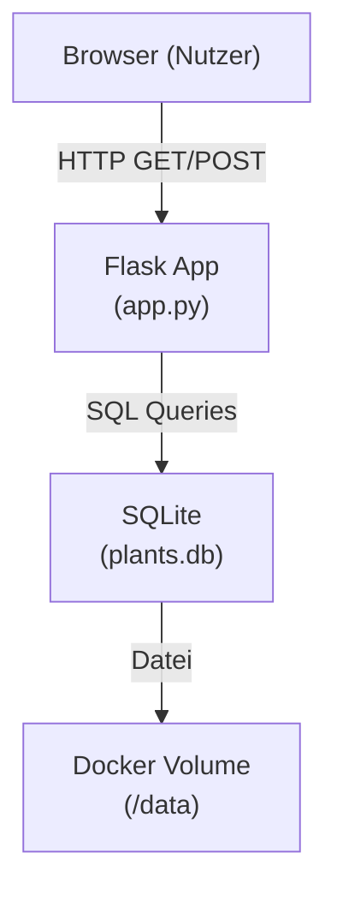

# Design-Dokument: Pflanzenereignisse

## Übersicht

Diese Erweiterung fügt dem bestehenden Garden Tracker drei neue Felder hinzu: **Ereignisse** (zeitlich begrenzte Ereignisse pro Pflanze), **Lichtbedarf** (Pflichtfeld mit drei Optionen) und **Kommentar** (optionaler Freitext). Die Erweiterung baut vollständig auf dem bestehenden Flask + SQLite + Jinja2-Stack auf und erfordert eine Datenmigration für bestehende Daten.

**Designentscheidungen:**
- Schema-Migration via `ALTER TABLE` (nicht DROP/CREATE) — bestehende Pflanzendaten bleiben erhalten.
- Neue `ereignisse`-Tabelle mit Fremdschlüssel auf `plants.id` und `ON DELETE CASCADE`.
- Monatsanzeige als deutsche Monatsnamen (Januar–Dezember) über ein Jinja2-Filter oder Template-Mapping.
- Validierung von Lichtbedarf und Ereignistyp auf Anwendungsebene (nicht nur per HTML-Constraint).

---

## Architektur



Das Request-Response-Muster bleibt unverändert. Neue Routen für Ereignisse folgen demselben POST-Redirect-GET-Muster wie die bestehenden `/add` und `/remove/<id>`-Routen.

---

## Komponenten und Schnittstellen

### Flask Application (`app.py`)

Neue und geänderte Routen:

| Route | Methode | Beschreibung |
|-------|---------|--------------|
| `/` | GET | Pflanzenliste anzeigen (unverändert) |
| `/add` | POST | Neue Pflanze hinzufügen — erweitert um `lichtbedarf` und `kommentar` |
| `/remove/<int:id>` | POST | Pflanze entfernen (unverändert, Cascade löscht Ereignisse) |
| `/plant/<int:plant_id>/ereignis/add` | POST | Neues Ereignis zu einer Pflanze hinzufügen |
| `/ereignis/<int:ereignis_id>/remove` | POST | Einzelnes Ereignis entfernen |

### Database Layer (`db.py`)

Geänderte und neue Funktionen:

```python
def init_db() -> None
# Erweitert: führt Migration durch (ALTER TABLE + CREATE TABLE IF NOT EXISTS)

def add_plant(name: str, type: str, variety: str | None,
              lichtbedarf: str, kommentar: str | None) -> None
# Erweitert: speichert lichtbedarf und kommentar

def get_all_plants() -> list[dict]
# Erweitert: gibt lichtbedarf, kommentar und ereignisse (als Liste) zurück

def add_ereignis(plant_id: int, ereignistyp: str,
                 startmonat: int, endmonat: int) -> None
# Neu: fügt ein Ereignis für eine Pflanze ein

def remove_ereignis(ereignis_id: int) -> None
# Neu: entfernt ein einzelnes Ereignis
```

### Templates (`templates/`)

- `index.html` — erweitert um:
  - Spalten `Lichtbedarf` und `Kommentar` in der Pflanzentabelle
  - Ereignisliste pro Pflanze (Typ + Startmonat–Endmonat als deutsche Monatsnamen)
  - Formular zum Hinzufügen eines Ereignisses pro Pflanze
  - Erweitertes Hinzufügen-Formular mit `lichtbedarf` (Select) und `kommentar` (Textarea)

### Monatsnamen-Mapping

Deutsche Monatsnamen werden über ein Dictionary im Template-Kontext oder als Jinja2-Filter bereitgestellt:

```python
GERMAN_MONTHS = {
    1: "Januar", 2: "Februar", 3: "März", 4: "April",
    5: "Mai", 6: "Juni", 7: "Juli", 8: "August",
    9: "September", 10: "Oktober", 11: "November", 12: "Dezember"
}
```

---

## Datenmodelle

### Schema-Migration in `init_db()`

```sql
-- Schritt 1: Neue Spalten zur plants-Tabelle hinzufügen (idempotent)
ALTER TABLE plants ADD COLUMN lichtbedarf TEXT;
ALTER TABLE plants ADD COLUMN kommentar   TEXT;

-- Schritt 2: Ereignisse-Tabelle anlegen (idempotent)
CREATE TABLE IF NOT EXISTS ereignisse (
    id          INTEGER PRIMARY KEY AUTOINCREMENT,
    plant_id    INTEGER NOT NULL REFERENCES plants(id) ON DELETE CASCADE,
    ereignistyp TEXT    NOT NULL,  -- 'Blüte' | 'Ernte' | 'Düngen' | 'Rückschnitt'
    startmonat  INTEGER NOT NULL,  -- 1..12
    endmonat    INTEGER NOT NULL   -- 1..12, >= startmonat
);
```

`ALTER TABLE ... ADD COLUMN` schlägt fehl, wenn die Spalte bereits existiert. Die Migration prüft daher zuerst, ob die Spalten vorhanden sind:

```python
def _migrate(conn: sqlite3.Connection) -> None:
    cols = {row[1] for row in conn.execute("PRAGMA table_info(plants)")}
    if "lichtbedarf" not in cols:
        conn.execute("ALTER TABLE plants ADD COLUMN lichtbedarf TEXT")
    if "kommentar" not in cols:
        conn.execute("ALTER TABLE plants ADD COLUMN kommentar TEXT")
    conn.execute("""
        CREATE TABLE IF NOT EXISTS ereignisse (
            id          INTEGER PRIMARY KEY AUTOINCREMENT,
            plant_id    INTEGER NOT NULL REFERENCES plants(id) ON DELETE CASCADE,
            ereignistyp TEXT    NOT NULL,
            startmonat  INTEGER NOT NULL,
            endmonat    INTEGER NOT NULL
        )
    """)
    conn.commit()
```

### Python-Darstellung (als dict)

```python
# Plant
{
    "id":         int,
    "name":       str,
    "type":       str,
    "variety":    str | None,
    "lichtbedarf": str | None,   # 'Sonne' | 'Halbschatten' | 'Schatten' | None (Altdaten)
    "kommentar":  str | None,
    "ereignisse": list[dict]     # leer wenn keine Ereignisse
}

# Ereignis
{
    "id":          int,
    "plant_id":    int,
    "ereignistyp": str,   # 'Blüte' | 'Ernte' | 'Düngen' | 'Rückschnitt'
    "startmonat":  int,   # 1..12
    "endmonat":    int    # 1..12
}
```

**Validierungsregeln (Anwendungsebene):**
- `lichtbedarf` muss einer der Werte `Sonne`, `Halbschatten`, `Schatten` sein (Pflichtfeld bei neuen Pflanzen).
- `ereignistyp` muss einer der Werte `Blüte`, `Ernte`, `Düngen`, `Rückschnitt` sein.
- `startmonat` und `endmonat` müssen im Bereich 1–12 liegen.
- `startmonat <= endmonat` muss gelten.
- Altdaten mit `lichtbedarf = NULL` werden ohne erzwungenen Standardwert angezeigt.

---

## Correctness Properties

*A property is a characteristic or behavior that should hold true across all valid executions of a system — essentially, a formal statement about what the system should do. Properties serve as the bridge between human-readable specifications and machine-verifiable correctness guarantees.*

### Property 1: Ereignis-Round-Trip

*For any* plant and any list of valid Ereignisse (with valid Ereignistyp, Startmonat 1–12, Endmonat >= Startmonat), after inserting all Ereignisse via `add_ereignis()` and retrieving the plant via `get_all_plants()`, the returned Ereignisse list SHALL contain every inserted Ereignis with exactly the same Ereignistyp, Startmonat, and Endmonat values.

**Validates: Requirements 1.1, 1.2, 1.6, 1.7**

---

### Property 2: Ungültige Ereignistypen werden abgelehnt

*For any* string that is not in `{'Blüte', 'Ernte', 'Düngen', 'Rückschnitt'}`, submitting it as Ereignistyp SHALL result in a rejection (HTTP 400) with a German-language error message, and no Ereignis SHALL be stored.

**Validates: Requirements 1.3**

---

### Property 3: Ungültige Monatswerte werden abgelehnt

*For any* integer outside the range 1–12 (e.g. 0, 13, negative values) submitted as Startmonat or Endmonat, the submission SHALL be rejected (HTTP 400) with a German-language error message, and no Ereignis SHALL be stored.

**Validates: Requirements 1.4**

---

### Property 4: Startmonat > Endmonat wird abgelehnt

*For any* pair (startmonat, endmonat) where startmonat > endmonat and both are in range 1–12, submitting this Ereignis SHALL be rejected (HTTP 400) with a German-language error message, and no Ereignis SHALL be stored.

**Validates: Requirements 1.5**

---

### Property 5: Cascade-Delete bei Pflanzenlöschung

*For any* plant with any number of associated Ereignisse, after calling `remove_plant(plant_id)`, no Ereignisse with that `plant_id` SHALL remain in the database.

**Validates: Requirements 1.8**

---

### Property 6: Pflanzenliste rendert alle Ereignisse

*For any* plant with N Ereignisse (N >= 1), the rendered HTML of the Plant_List SHALL contain the Ereignistyp, the German month name for Startmonat, and the German month name for Endmonat for every Ereignis of that plant.

**Validates: Requirements 2.1, 2.2**

---

### Property 7: Lichtbedarf-Round-Trip

*For any* plant added with a valid Lichtbedarf value (`Sonne`, `Halbschatten`, or `Schatten`), after storing and retrieving the plant, the Lichtbedarf value SHALL be byte-for-byte identical to the original input, and the rendered Plant_List SHALL display that value.

**Validates: Requirements 3.2, 3.4**

---

### Property 8: Ungültiger Lichtbedarf wird abgelehnt

*For any* string that is not in `{'Sonne', 'Halbschatten', 'Schatten'}` (including empty string), submitting it as Lichtbedarf SHALL result in a rejection (HTTP 400) with a German-language error message, and no Plant SHALL be stored.

**Validates: Requirements 3.2, 3.3**

---

### Property 9: Kommentar-Round-Trip

*For any* arbitrary string (including long text, German special characters, Unicode), after storing it as Kommentar and retrieving the plant, the Kommentar value SHALL be byte-for-byte identical to the original input, and the rendered Plant_List SHALL display that value.

**Validates: Requirements 4.2, 4.3**

---

## Fehlerbehandlung

| Fehlerfall | Verhalten |
|------------|-----------|
| Lichtbedarf fehlt oder ungültig beim Hinzufügen | HTTP 400, deutsche Fehlermeldung im Template |
| Ungültiger Ereignistyp | HTTP 400, deutsche Fehlermeldung |
| Monatswert außerhalb 1–12 | HTTP 400, deutsche Fehlermeldung |
| Startmonat > Endmonat | HTTP 400, deutsche Fehlermeldung |
| Migration schlägt fehl beim Start | Fehler loggen, Exit-Code ≠ 0 |
| Pflanze mit ungültiger ID beim Entfernen | Stille Ignorierung (kein Datenverlust) |
| Ereignis mit ungültiger ID beim Entfernen | Stille Ignorierung |

Fehlermeldungen (Deutsch):
- `"Lichtbedarf muss Sonne, Halbschatten oder Schatten sein."`
- `"Ereignistyp muss Blüte, Ernte, Düngen oder Rückschnitt sein."`
- `"Monat muss zwischen 1 und 12 liegen."`
- `"Startmonat darf nicht größer als Endmonat sein."`

---

## Testing-Strategie

### Ansatz

Die Kernlogik besteht aus Datenbankoperationen, Validierungsregeln und Template-Rendering — alles gut geeignet für property-based testing. Migrations- und Konfigurationsprüfungen werden als Smoke-Tests ausgeführt.

**PBT-Bibliothek:** [Hypothesis](https://hypothesis.readthedocs.io/) (Python, bereits im Projekt verwendet)

### Property-Based Tests (Hypothesis, min. 100 Iterationen je Property)

| Test | Property | Beschreibung |
|------|----------|--------------|
| `test_ereignis_roundtrip` | Property 1 | Zufällige Ereignisse einfügen, abrufen, Felder vergleichen |
| `test_invalid_ereignistyp_rejected` | Property 2 | Ungültige Typen → HTTP 400 + kein Eintrag in DB |
| `test_invalid_monat_rejected` | Property 3 | Monatswerte außerhalb 1–12 → HTTP 400 |
| `test_start_after_end_rejected` | Property 4 | start > end → HTTP 400 + deutsche Fehlermeldung |
| `test_cascade_delete` | Property 5 | Pflanze mit Ereignissen löschen → keine Ereignisse übrig |
| `test_render_ereignisse` | Property 6 | Zufällige Ereignisse rendern → Typ + Monatsnamen im HTML |
| `test_lichtbedarf_roundtrip` | Property 7 | Gültige Lichtbedarf-Werte speichern und im HTML prüfen |
| `test_invalid_lichtbedarf_rejected` | Property 8 | Ungültige Werte → HTTP 400 |
| `test_kommentar_roundtrip` | Property 9 | Beliebige Strings als Kommentar speichern und abrufen |

Tag-Format: `# Feature: pflanzenereignisse, Property {N}: {property_text}`

### Example-Based Tests (pytest)

| Test | Anforderung | Beschreibung |
|------|-------------|--------------|
| `test_add_plant_without_lichtbedarf` | 3.1, 3.3 | Formular ohne Lichtbedarf → HTTP 400 + deutsche Meldung |
| `test_plant_without_kommentar` | 4.1, 4.4 | Pflanze ohne Kommentar → kein Kommentar-Feld im HTML |
| `test_plant_without_ereignisse` | 2.3 | Pflanze ohne Ereignisse → kein Ereignis-Abschnitt im HTML |
| `test_migrated_plant_display` | 5.3 | Altdaten nach Migration → leerer Kommentar, keine Ereignisse |

### Smoke Tests

| Test | Anforderung | Beschreibung |
|------|-------------|--------------|
| `test_migration_adds_columns` | 5.1 | Alte DB → Migration fügt Spalten hinzu, Zeilen bleiben erhalten |
| `test_migration_creates_ereignisse_table` | 5.2 | DB ohne ereignisse-Tabelle → Tabelle wird angelegt |
