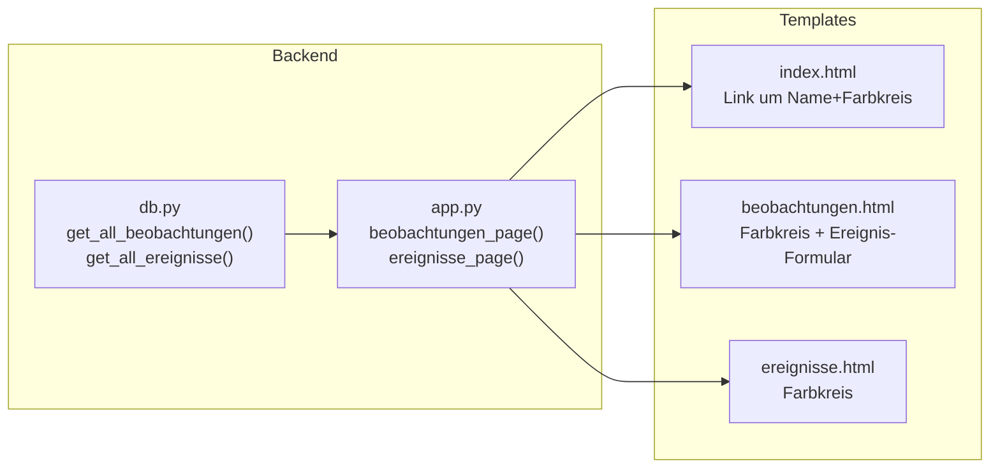

# Design: UI-Konsistenz-Verbesserungen

## Übersicht

Drei zusammenhängende Template- und Route-Änderungen, die das visuelle Erscheinungsbild und die Navigation des Garten-Trackers vereinheitlichen:

1. **Farbkreis bei Pflanzennamen** auf Tagebuch- (`/beobachtungen`) und Jahresplan-Seite (`/ereignisse`) — analog zur Startseite
2. **Pflanzennamen als Link** auf der Startseite — Klick auf Name+Farbkreis führt zur Detailseite
3. **Ereignis-Formular auf der Tagebuchseite** — Jahresplan-Einträge direkt von `/beobachtungen` aus anlegen

Alle Änderungen betreffen ausschließlich bestehende Templates, zwei DB-Abfragen und eine Route. Kein neues Datenmodell, keine neuen Tabellen, keine neuen Abhängigkeiten.

## Architektur

Die bestehende Zwei-Datei-Architektur (`app.py` + `db.py`) bleibt unverändert. Die Änderungen verteilen sich auf:



**Entscheidung**: Das Ereignis-Formular auf der Tagebuchseite nutzt die bestehende Route `/plant/<plant_id>/ereignis/add` mit einem Pflanzen-Dropdown statt einer neuen Route. Die `plant_id` kommt aus dem Formular-Select statt aus der URL. Dafür wird eine kleine Wrapper-Route oder ein JavaScript-basierter `action`-Wechsel benötigt. Da das Projekt minimales JS bevorzugt, wird eine neue Route `/ereignis/add` erstellt, die die `plant_id` aus dem Formular-Body liest und die bestehende Validierungslogik wiederverwendet.

## Komponenten und Schnittstellen

### 1. DB-Abfragen erweitern (`db.py`)

**`get_all_beobachtungen()`** — `p.farbe` zum SELECT hinzufügen:
```sql
SELECT b.id AS beobachtung_id, b.plant_id, p.name AS plant_name,
       p.kategorie, p.farbe, b.jahr, b.ereignistyp, ...
```

**`get_all_ereignisse()`** — `p.farbe` zum SELECT hinzufügen:
```sql
SELECT e.id AS ereignis_id, e.plant_id, p.name AS plant_name,
       p.kategorie, p.farbe, e.ereignistyp, ...
```

### 2. Template-Änderungen

**`index.html`** — Pflanzennamen-Zelle: Farbkreis + Name in einen `<a>`-Link wrappen:
```html
<td>
  <a href="/plant/{{ plant.id }}/edit">
    <span class="color-dot" style="background:{{ plant.farbe }}"></span>
    <strong>{{ plant.name }}</strong>
  </a>
  ...badges...
</td>
```

**`beobachtungen.html`** — Farbkreis vor Pflanzennamen in der Tabelle:
```html
<td>
  <a href="/plant/{{ b.plant_id }}/edit">
    <span class="color-dot" style="background:{{ b.farbe }}"></span>
    {{ b.plant_name }}
  </a>
</td>
```

**`ereignisse.html`** — Farbkreis vor Pflanzennamen in der Tabelle:
```html
<td>
  <a href="/plant/{{ e.plant_id }}/edit">
    <span class="color-dot" style="background:{{ e.farbe }}"></span>
    {{ e.plant_name }}
  </a>
</td>
```

### 3. Neue Route für Ereignis-Hinzufügen von Tagebuchseite (`app.py`)

**`POST /ereignis/add`** — Neue Route, die `plant_id` aus dem Formular-Body liest:
- Liest `plant_id` aus `request.form`
- Validiert, dass die Pflanze existiert und aktiv ist
- Delegiert die restliche Validierung an die bestehende Ereignis-Logik (Ereignistyp, Monate, Details)
- Redirect zurück zu `/beobachtungen`

**`beobachtungen_page()`** — Muss zusätzlich die aktive Pflanzenliste an das Template übergeben:
```python
plants = get_all_plants()  # für das Pflanzen-Dropdown
```

Sowie `zeitraum_ereignistypen` und `valid_ereignistypen` (bereits vorhanden).

### 4. Ereignis-Formular im Template (`beobachtungen.html`)

Ein neues Card-Element unterhalb der Tabelle mit:
- Pflanzen-Dropdown (alle aktiven Pflanzen)
- Ereignistyp-Select (identisch zu `edit.html`)
- Start-Detail, Startmonat, End-Detail, Endmonat (Bis-Felder per JS ein-/ausblenden)
- Submit-Button

Das Formular postet an `/ereignis/add` mit `next=/beobachtungen`.

### 5. Link-Styling (`style.css`)

Minimale Ergänzung: Links in Tabellenzellen sollen die Textfarbe erben und nur bei Hover unterstrichen werden, damit der Farbkreis visuell nicht gestört wird.

## Datenmodell

Keine Änderungen am Datenbankschema. Die bestehenden Tabellen `plants`, `ereignisse` und `beobachtungen` bleiben unverändert. Lediglich die SELECT-Abfragen in `get_all_beobachtungen()` und `get_all_ereignisse()` werden um das Feld `p.farbe` erweitert.


## Correctness Properties

*Eine Property ist eine Eigenschaft oder ein Verhalten, das über alle gültigen Ausführungen eines Systems hinweg gelten soll — im Grunde eine formale Aussage darüber, was das System tun soll. Properties bilden die Brücke zwischen menschenlesbaren Spezifikationen und maschinenverifizierbaren Korrektheitsgarantien.*

### Property 1: Farbe-Feld in Beobachtungen und Ereignissen

*Für jede* Pflanze mit oder ohne zugewiesener Farbe und beliebigen Beobachtungen/Ereignissen sollen `get_all_beobachtungen()` und `get_all_ereignisse()` jeweils ein `farbe`-Feld zurückgeben, das exakt dem `farbe`-Wert der zugehörigen Pflanze entspricht (einschließlich `None`).

**Validates: Requirements 1.1, 1.2, 1.4**

### Property 2: Nur aktive Pflanzen im Ereignis-Dropdown

*Für jede* Mischung aus aktiven und inaktiven Pflanzen soll die Tagebuchseite (`/beobachtungen`) im Ereignis-Formular ausschließlich aktive Pflanzen im Pflanzen-Dropdown auflisten.

**Validates: Requirements 3.2**

### Property 3: Gültiges Ereignis wird über Tagebuchseite gespeichert

*Für jede* gültige Kombination aus aktiver Pflanze, gültigem Ereignistyp und gültigen Monaten (1–12) soll `POST /ereignis/add` das Ereignis in der Datenbank speichern und einen Redirect zur Tagebuchseite zurückgeben.

**Validates: Requirements 3.5**

### Property 4: Ungültiger Ereignistyp wird abgelehnt

*Für jeden* String, der nicht in der Menge der gültigen Ereignistypen enthalten ist, soll `POST /ereignis/add` eine Fehlermeldung zurückgeben und kein Ereignis speichern.

**Validates: Requirements 3.7**

## Fehlerbehandlung

| Fehlerfall | Verhalten | HTTP-Status |
|---|---|---|
| `POST /ereignis/add` ohne `plant_id` | Fehlermeldung „Bitte eine Pflanze auswählen." auf Tagebuchseite | 400 |
| `POST /ereignis/add` mit ungültiger `plant_id` | Fehlermeldung „Pflanze nicht gefunden." auf Tagebuchseite | 400 |
| `POST /ereignis/add` mit inaktiver Pflanze | Fehlermeldung „Pflanze nicht gefunden." auf Tagebuchseite | 400 |
| `POST /ereignis/add` mit ungültigem Ereignistyp | Fehlermeldung „Ereignistyp ungültig." auf Tagebuchseite | 400 |
| `POST /ereignis/add` mit ungültigem Monat | Fehlermeldung „Monat muss zwischen 1 und 12 liegen." auf Tagebuchseite | 400 |
| `POST /ereignis/add` mit Startmonat > Endmonat (bei Zeitraum) | Fehlermeldung „Startmonat darf nicht größer als Endmonat sein." auf Tagebuchseite | 400 |

Fehler-Rendering nutzt eine neue Hilfsfunktion `_render_beobachtungen_error(error)`, die analog zu `_render_index_error()` die Tagebuchseite mit Fehlermeldung rendert.

## Teststrategie

### Property-basierte Tests (Hypothesis)

Bibliothek: `hypothesis` (bereits im Projekt vorhanden)

Jeder Property-Test läuft mit mindestens 100 Iterationen. Testdatei: `tests/test_ui_konsistenz_properties.py`

| Property | Test-Tag | Beschreibung |
|---|---|---|
| 1 | `Feature: ui-konsistenz-verbesserungen, Property 1: Farbe-Feld in Beobachtungen und Ereignissen` | Generiert Pflanzen mit/ohne Farbe + Beobachtungen/Ereignisse, prüft farbe-Feld in DB-Abfragen |
| 2 | `Feature: ui-konsistenz-verbesserungen, Property 2: Nur aktive Pflanzen im Ereignis-Dropdown` | Generiert aktive/inaktive Pflanzen, prüft GET /beobachtungen HTML-Output |
| 3 | `Feature: ui-konsistenz-verbesserungen, Property 3: Gültiges Ereignis wird gespeichert` | Generiert gültige Ereignis-Daten, prüft POST /ereignis/add speichert korrekt |
| 4 | `Feature: ui-konsistenz-verbesserungen, Property 4: Ungültiger Ereignistyp wird abgelehnt` | Generiert ungültige Ereignistyp-Strings, prüft Ablehnung |

### Beispiel-basierte Tests

Testdatei: `tests/test_ui_konsistenz.py`

- Farbkreis im HTML-Output von `/beobachtungen` und `/ereignisse` vorhanden (1.1, 1.2)
- Kein Farbkreis wenn Pflanze keine Farbe hat (1.4)
- Pflanzenname auf Startseite ist Link zu `/plant/<id>/edit` (2.1)
- Farbkreis und Name im selben `<a>`-Tag (2.2)
- Bearbeiten-Button (✏️) weiterhin in Aktionsspalte (2.3)
- Ereignis-Formular auf Tagebuchseite vorhanden (3.1)
- Formular enthält alle erwarteten Felder (3.3)
- Fehlermeldung bei fehlender Pflanze (3.6)
