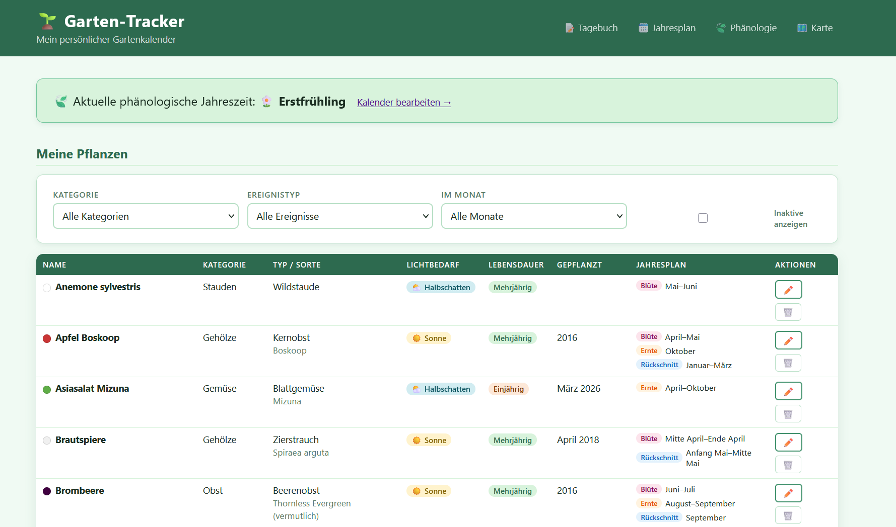

# 🌱 Garten-Tracker

Eine persönliche Web-App zur Verwaltung von Gartenpflanzen mit Ereigniskalender, Beobachtungslogbuch und phänologischem Kalender. Läuft als Docker-Container auf einem Raspberry Pi und speichert Daten in SQLite.



## Funktionen

- **Pflanzenverwaltung** — Kategorie, Typ, Sorte, Lichtbedarf, Lebensdauer, Farbe, Anzahl, Pflanzmonat/-jahr, Beschreibung, Kommentar
- **Erwartete Ereignisse** — Blüte, Ernte, Düngen, Rückschnitt, Vorkultur, Auspflanzen, Direktsaat mit Monatsbereich und optionalem Anfang/Mitte/Ende
- **Beobachtungslogbuch** — tatsächliche Zeiträume pro Jahr festhalten und mit Erwartungen vergleichen
- **Chronologische Listen** — pflanzenübergreifende Beobachtungs- und Ereignislisten, chronologisch sortiert nach Sortierwert
- **Phänologischer Kalender** — 10 Jahreszeiten pro Jahr erfassen, aktuelle Phase auf der Startseite
- **Pflanze duplizieren** — Satz-Kopie mit allen Stammdaten und Ereignissen
- **Pflanzen deaktivieren** — Inaktiv setzen statt löschen, Daten bleiben erhalten, über Filter wieder einblendbar
- **Filter** — Kategorie, Ereignistyp und Monat auf allen Listen und der Gartenkarte
- **Gartenkarte** — Kartenbild hochladen, Pflanzen per Klick platzieren, kategoriespezifische Markierungen (Gehölze groß+rund, Gartenpflege groß+eckig), Hervorhebung der ausgewählten Pflanze, nur aktive Pflanzen sichtbar
- **Responsives Design** — Desktop und Smartphone
- **Komplett auf Deutsch**

## Voraussetzungen

- [Docker](https://docs.docker.com/get-docker/)
- [Git](https://git-scm.com/)

## Installation

```bash
git clone https://github.com/achimbarczok/garden-tracker.git
cd garden-tracker
docker build -t garden-tracker .
```

## Container starten

```bash
docker run -d \
  -p 8080:5000 \
  -v garden-data:/data \
  --name garden-tracker \
  --restart unless-stopped \
  garden-tracker
```

Dann im Browser öffnen: `http://<raspberry-pi-ip>:8080`

## Pflanzen vorausfüllen

Beim ersten Start können Pflanzen mit recherchierten Daten eingetragen werden:

```bash
docker exec garden-tracker python seed_plants.py
```

## Update

```bash
cd garden-tracker
git pull
docker build -t garden-tracker .
docker stop garden-tracker && docker rm garden-tracker
docker run -d -p 8080:5000 -v garden-data:/data --name garden-tracker --restart unless-stopped garden-tracker
```

## Container stoppen

```bash
docker stop garden-tracker && docker rm garden-tracker
```

## Daten

Alle Daten werden im Docker-Volume `garden-data` gespeichert und überleben Container-Neustarts und Updates.

## Lokale Entwicklung

```bash
python -m venv .venv
source .venv/bin/activate   # Windows: .venv\Scripts\activate
pip install -r requirements.txt

DB_PATH=plants.db flask run          # App starten
DB_PATH=plants.db python seed_plants.py  # Beispieldaten laden
pytest                                # Tests ausführen
```

## Technik

- Python 3.12, Flask, Jinja2-Templates
- SQLite (kein ORM, raw SQL)
- Vanilla CSS, kein JavaScript-Framework
- Property-Based Testing mit Hypothesis, Example-Based Tests mit pytest
- Docker (python:3.12-slim)

## Transparenzhinweis

Diese Software wurde vollständig mit KI-Unterstützung entwickelt. Konzeption, Architektur, Code, Templates, Tests und Dokumentation wurden mithilfe von [Kiro](https://kiro.dev) (AI IDE von Amazon) erstellt. Der Entwicklungsprozess folgte einem Spec-Driven-Development-Ansatz: Für jedes Feature wurden zunächst Anforderungen und ein technisches Design erarbeitet, daraus Implementierungsaufgaben abgeleitet und diese dann umgesetzt — jeweils im Dialog zwischen Mensch und KI. Die formale Korrektheit wird durch Property-Based Tests (Hypothesis) abgesichert.
